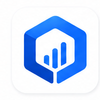
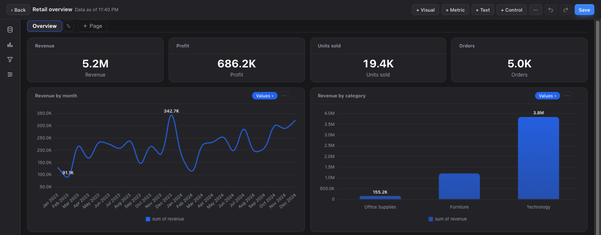
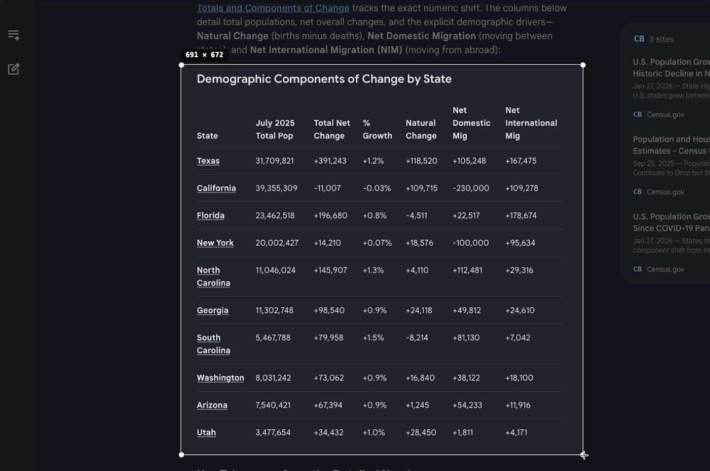
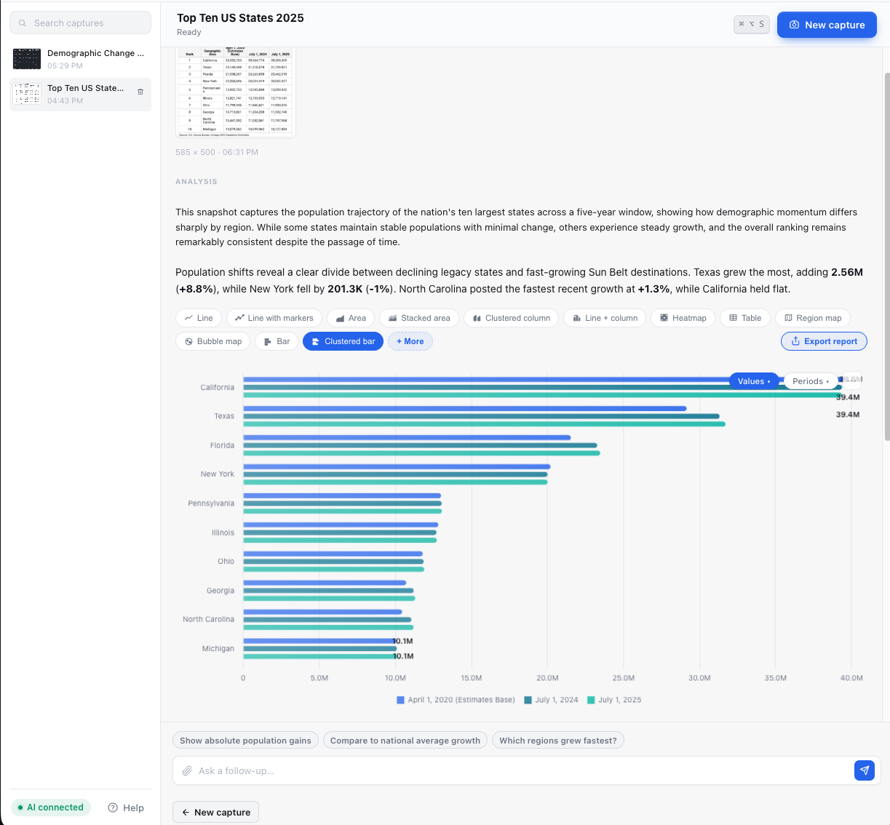
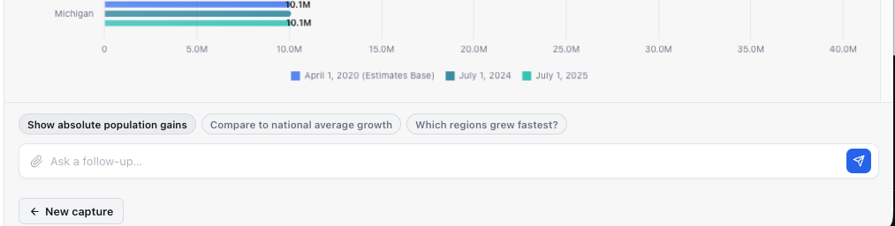
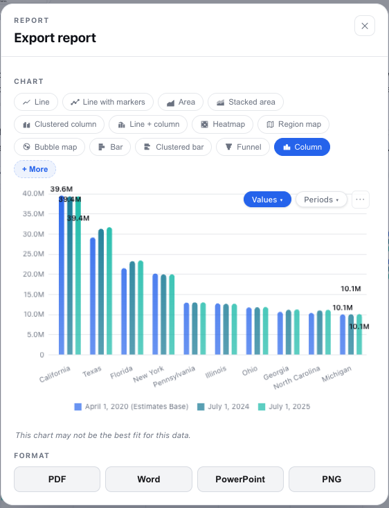
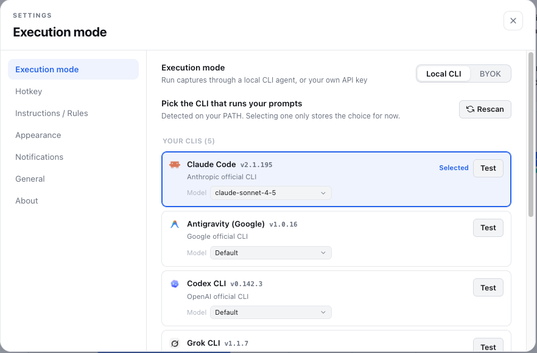
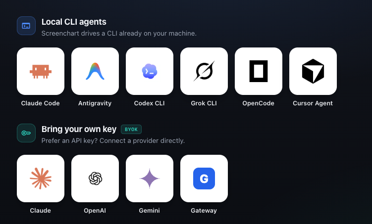

<p align="center">
  
</p>

<h1 align="center">Ordinate</h1>

<p align="center"><b>A local-first, open-source personal BI workspace. Bring in your data (files, paste, Excel, Postgres, a URL, or a screenshot), prepare it, visualize it across 28 chart &amp; map types, assemble dashboards, and share. Optional AI on top; the app does the math.</b></p>

<p align="center">Local-first · model-agnostic · open source. Your data stays on your machine; every number is computed by the app.</p>

<p align="center">
  <!-- TODO(ashish): replace assets/images/hero.png with a wide hero banner showing the workspace (data → prepare → visualize → dashboard). -->
  
</p>

<p align="center">
  <a href="https://screenchart.app">Website</a> ·
  <a href="https://github.com/AshishB2000/ordinate/releases">Download</a> ·
  <a href="https://github.com/AshishB2000/ordinate/discussions">Discussions</a> ·
  <a href="https://github.com/AshishB2000/ordinate/issues">Issues</a>
</p>

<p align="center">
  <a href="https://github.com/AshishB2000/ordinate/releases"></a>
  <a href="LICENSE"></a>
  
  
</p>

---

## What is Ordinate

Ordinate is a **personal business-intelligence workspace that runs entirely on your machine.** You organize work into **projects**, bring **data** in from many sources, **prepare** it with a reversible transform pipeline, build **visuals** and **dashboards**, and **share** them offline. AI is available at every step but is **completely optional**, and even when it is on, **the app computes every number itself.**

📥 **Bring in data** from CSV, JSON, or Excel files; from pasted text (TSV/CSV/JSON, auto-sniffed); from a **Postgres** database; from a **URL / JSON API**; or by **screenshotting** anything on screen and turning it into a table.

🧹 **Prepare** it with a reversible, step-by-step pipeline: calculated fields, filters, group &amp; aggregate, dedupe, fill/trim, rename, drop, and combine (append or join). Remove any step and the result recomputes from the original source.

📊 **Visualize** across **28 chart &amp; map types** (25 charts + 2 maps + a table view), powered by Chart.js 4 and Leaflet.

🗂️ **Assemble dashboards** on a 12-column grid across multiple pages, with visual cards, text cards, and computed metric cards, plus dashboard-wide cross-filters that span different datasets.

📤 **Share** a dashboard as self-contained interactive HTML, a PNG, or a PDF, all fully offline; export a single result to PDF, Word, or PowerPoint; or reveal the project's plain-JSON folder and commit it to a git repo.

🤖 **Optional AI** adds a project copilot, transform/chart/field suggestions, dashboard summaries, and plain-English explanations of anomalies the **app** detected. Every AI action is gated on a model you configure and simply reports "not ready" when none is set.

**Core principle:** the app does the math. All aggregation, statistics, metrics, and anomaly detection run in pure code; a model may extract structure or narrate figures the app already computed, but it is **never** the source of a number.

---

## See it in action

https://github.com/user-attachments/assets/8d0a13db-bc9f-463f-a849-7ca74f77af54

---

## Product tour

### Bring in data → prepare → visualize → dashboard → share

<table>
<tr>
<td width="50%" valign="middle">
<!-- TODO(ashish): assets/images/sources.png - the data-source picker (file/paste/Postgres/URL/capture). -->
<br/>
<sub><b>Bring in data</b> - import a CSV, JSON, or Excel file; paste a table (TSV/CSV/JSON is auto-detected); connect a Postgres database; fetch a JSON URL; or screenshot on-screen data and turn it into a dataset.</sub>
</td>
<td width="50%" valign="middle">
<!-- TODO(ashish): assets/images/prepare.png - the Prepare transform pipeline. -->
<br/>
<sub><b>Prepare &amp; explore</b> - stack reversible steps (calculated fields, filters, group/aggregate, dedupe, rename, drop, combine), review per-column stats, and see quality flags for empty-heavy, constant, or duplicate data.</sub>
</td>
</tr>
<tr>
<td width="50%" valign="middle">
<!-- TODO(ashish): assets/images/dashboard.png - a multi-card dashboard with cross-filters. -->
<br/>
<sub><b>Visualize &amp; assemble</b> - save visuals (dataset + encoding + chart type + style), then place them on a multi-page dashboard grid alongside text and computed metric cards, with cross-visual filters.</sub>
</td>
<td width="50%" valign="middle">
<!-- TODO(ashish): assets/images/share.png - dashboard export / git-share folder. -->
<br/>
<sub><b>Share</b> - export a dashboard as offline interactive HTML, PNG, or PDF; export a single result to PDF, Word, or PowerPoint; or commit the project's plain-JSON folder to a repo.</sub>
</td>
</tr>
</table>

---

## Visualizations

Ordinate picks a visual that fits your data, and you can switch types from the `⋯` menu. Grouped data supports Values/Periods toggles and small multiples where they fit. There are **28 chart &amp; map types** in total: **25 chart types, 2 maps, and a table view.**

| Group | Types |
|---|---|
| **Bar &amp; column** | Column · Clustered column · Stacked column · 100% stacked column · Bar · Clustered bar · Stacked bar · 100% stacked bar |
| **Line &amp; area** | Line · Line with markers · Area · Stacked area · Line + column (combo) |
| **Part-to-whole** | Pie · Donut · Treemap · Funnel |
| **Distribution &amp; relationship** | Scatter · Bubble · Histogram · Box plot · Heatmap |
| **Flow &amp; finance** | Sankey · Candlestick |
| **Single value / tabular** | Gauge · Table |
| **Maps** | Region map (choropleth) · Bubble map |

Charts render with **Chart.js 4** (plus treemap, sankey, matrix, financial, and boxplot plugins); maps with **Leaflet** (OpenStreetMap tiles). Chart eligibility is filtered per data shape, so you normally see the subset that fits a given dataset rather than all 25 at once. Geographic maps support country, US state, US county, US city, and US ZIP levels.

---

## Data sources

| Source | What it does |
|---|---|
| **File import** | Native file picker for **CSV, JSON, or XLSX**. CSV uses a real RFC-4180 parser (quoted fields, embedded commas/newlines, CRLF/LF). XLSX is **read-only, one sheet at a time**, with a sheet picker. 100 MB / 50,000-row ceilings apply. |
| **Paste** | Paste a table and Ordinate auto-detects JSON vs delimited and sniffs tab vs comma, so **TSV works via paste** (there is no `.tsv` file-open option). |
| **Postgres** | Connect with a timeout, browse tables, and run either a whitelisted table read or your own read-only SQL (wrapped with a row limit and a statement timeout). Read-only. |
| **URL / JSON API** | Fetch an **https-only** URL (byte-capped, timeout-bounded), with an optional bearer token, and parse the JSON body. Read-only. |
| **Screenshot capture** | Press the hotkey (**⌘⌥S** on macOS, **Ctrl+Alt+S** on Windows, configurable), drag a box around on-screen data, and a vision model extracts a table you review, edit, and save, with a link back to the crop. |
| **Combine** | Build a new dataset by appending (union of columns) or inner-joining two existing datasets on a key. |

Identifier columns are protected everywhere: values like `007`, ZIP codes, or IDs longer than 15 digits stay text and are never coerced into figures.

---

## AI is optional

The entire workspace (import, prepare, explore, visualize, dashboard, export) works with **no model configured at all.** When you do connect one, AI becomes available as help, never as the source of numbers:

- **Copilot chat** - a per-project assistant that answers against app-computed facts about your datasets, visuals, and dashboards. It narrates figures the app calculated and is instructed not to recompute them. It has a hard on/off switch.
- **Suggestions** - propose transform steps, a calculated field, or a chart for a dataset.
- **Dashboard help** - draft a layout, write an executive summary, or explain anomalies.
- **Anomalies** are found by a **pure code detector** (outliers, dominant categories, empty-heavy or constant columns, period-over-period swings). The model only puts the app's findings into words.

Every AI action is gated on a configured model and returns "not ready" when none is set.

---

## Two ways to run a model

When you want AI, Ordinate never ships or installs a model. It **runs a local CLI you already have**, or calls a **cloud API with your own key.** Pick per your privacy/latency needs in **Settings → Execution.**

<table>
<tr>
<td valign="top">
<br/>
<sub><b>Execution settings</b> - choose a detected Local CLI, or bring your own key for a cloud provider.</sub>
</td>
</tr>
</table>

### 🖥️ Local CLI (default) - detect &amp; run only, never install

Ordinate detects agent CLIs already on your `PATH` and runs them in read-only mode. It **never** runs `npm/brew/curl install`; the "Install" button only opens the vendor's page.

| Local CLI | Vendor |
|---|---|
| [Claude Code](https://docs.anthropic.com/en/docs/claude-code/overview) | Anthropic |
| [Antigravity](https://antigravity.google) | Google |
| [Codex CLI](https://github.com/openai/codex) | OpenAI |
| [Grok CLI](https://github.com/superagent-ai/grok-cli) | xAI (community) |
| [OpenCode](https://opencode.ai) | opencode.ai (BYOK) |
| [Cursor Agent](https://cursor.com/cli) | Cursor (Anysphere) |

### 🔑 BYOK - bring your own key

Stored per-provider on your machine (plaintext in `userData/config.json`, gitignored; see [PRIVACY.md](PRIVACY.md)), never logged and never sent to a renderer.

| Family | Endpoints |
|---|---|
| **Anthropic** | Claude API |
| **OpenAI** | OpenAI API |
| **Gemini** | Google Gemini API |
| **Gateway** | Any OpenAI-compatible endpoint: OpenRouter, Ollama, LM Studio, or a custom URL |

<p align="center">
  
</p>

---

## Why Ordinate

Your data lives in a dozen places: a CSV export, a spreadsheet, a Postgres table, an internal API, a chart trapped in a slide. The usual options are all bad. A cloud BI tool wants your data on its servers and a subscription. A cloud chatbot may invent the numbers. Re-typing into a spreadsheet is slow and error-prone.

Ordinate is the local-first, number-honest alternative:

- 🔒 **Local &amp; private.** Everything runs on your machine. No accounts, no telemetry, no surprise network calls. The only declared external fetches are the model endpoint you chose (or a fully local CLI) and OpenStreetMap tiles, and tiles only when a map is shown.
- 🧮 **Number-accurate by design.** All aggregation, statistics, metrics, and anomaly math live in pure code. A model may extract structure or narrate app-computed facts, but it is **forbidden** from writing computed numbers, so the figure you read is the figure the app calculated.
- 🔑 **Secrets never leave the main process.** Postgres passwords and URL tokens live only in gitignored config, are stripped from connection metadata and error strings, and never reach a renderer, a shareable project folder, or an export.
- 🤝 **Yours to keep and share.** Projects are plain JSON on disk. Export a dashboard as offline HTML, PNG, or PDF; export a result to PDF, Word, or PPT; or commit the project folder to git.
- 🤖 **Model-agnostic and optional.** The `claude` / `codex` / `cursor-agent` / … already on your `PATH` are the engine, or any cloud API via BYOK, or nothing at all.

### Comparison

| | Spreadsheet | Cloud BI tool | Cloud AI chatbot | **Ordinate** |
|---|:---:|:---:|:---:|:---:|
| Runs locally / private | ✅ | ❌ | ❌ | **✅ (local CLI)** |
| Numbers computed by the app (not guessed) | you do it | ✅ | ❌ (model may invent) | **✅** |
| Many data sources (files/DB/URL/screenshot) | limited | ✅ | ❌ | **✅** |
| Reversible prepare pipeline | manual | ✅ | ❌ | **✅** |
| Dashboards with cross-filters | limited | ✅ | ❌ | **✅** |
| Offline / self-contained export | ✅ | ❌ | ❌ | **✅** |
| AI is optional and add-on | - | rarely | required | **✅** |
| Open source | - | ❌ | ❌ | **✅ MIT** |

---

## Quick start

> **Why does my OS warn about this app?** Ordinate is free and open source and isn't signed with a paid code-signing certificate, so macOS and Windows show a one-time security prompt on first launch. This reflects the missing certificate, not the app's safety. The full source and build pipeline are public, and checksums are published with every release. See the first-launch steps below, or skip the prompt entirely by [running from source](#-run-from-source).

### 🧑‍💻 Run from source

Recommended if you have git: no installer and no first-launch security prompt.

```bash
git clone https://github.com/AshishB2000/ordinate.git
cd ordinate
npm install          # postinstall fetches map GeoJSON
npm start
```

Requirements: [Node.js](https://nodejs.org/) 20+ and npm. `npm start` compiles the TypeScript (`npm run build:ts`, run automatically) and launches Electron, with no bundler. Packaging installers uses electron-builder (`npm run dist:mac` / `npm run dist:win`).

### 🖥️ Download the app

- **macOS** (Apple Silicon + Intel, universal) → [Download](https://screenchart.app/download)
- **Windows** (x64) → [Download](https://screenchart.app/download)
- **Linux** - planned.

<details>
<summary><b>macOS - first launch (unsigned build)</b></summary>

Ordinate is a free, open-source build not signed with a paid Apple certificate, so macOS blocks it on first open. To allow it (you only do this once):

1. Double-click **Screenchart**; you'll see "could not verify." Click **Done**.
2. Open **System Settings → Privacy & Security**.
3. Scroll down to the message about Screenchart and click **Open Anyway**.
4. When it prompts again, click **Open Anyway**, then authenticate with your password or Touch ID.

It opens normally afterward. Screen Recording setup (needed for screenshot capture) is in [QUICKSTART.md](QUICKSTART.md).
</details>

<details>
<summary><b>Windows - first launch (unsigned build)</b></summary>

The installer isn't signed with a paid certificate, so Windows SmartScreen warns about the download. Click **More info → Run anyway** to continue.
</details>

### First steps

1. Create a **project**.
2. **Bring in data**: import a file, paste a table, connect Postgres, fetch a URL, or capture a screenshot. (To capture, grant Screen Recording permission and press **⌘⌥S** / **Ctrl+Alt+S**.)
3. **Prepare** it: add transform steps, review the column stats, fix quality flags.
4. Save a **visual**, place it on a **dashboard**, and add metric or text cards.
5. **Share**: export the dashboard to HTML/PNG/PDF, export a result to PDF/Word/PPT, or commit the project folder.
6. Optionally connect a model in **Settings → Execution** to unlock copilot chat and suggestions.

---

## How it fits together

A **project** is one directory of plain JSON on disk (`userData/projects/<id>/`), holding its datasets, visuals, and dashboards as separate files. Datasets carry their source kind and provenance; visuals are a dataset plus an encoding and chart type; dashboards reference visuals and compute their metric cards on the fly. Every id is a UUID, validated before it touches a path, and writes are atomic (temp file then rename), so a project folder stays safe to sync or commit.

Prepare, stats, metrics, aggregation, and anomaly detection all run as pure main-process modules; a model is called only to extract a table from a screenshot or to narrate facts the app already computed.

Architecture and internals → [CLAUDE.md](CLAUDE.md).

### Where this is going

Today the data layer is ~2,500 lines of TypeScript: a table is `{ columns, rows }`, and prepare is an ordered list of steps folded over an immutable copy of the source. That design is why removing a step is free — the result simply recomputes. It is comfortable with thousands of rows.

A migration to a columnar engine is planned, to make cross-filtered dashboards interactive on millions of rows:

| Layer | Today | Planned |
|---|---|---|
| Engine | TypeScript fold over `Cell[][]` | **DuckDB**, embedded |
| Memory format | JS arrays of boxed cells | **Apache Arrow** (zero-copy) |
| Storage | JSON per record | **Parquet** for table data |
| Cross-filtering | Filters merged per card, re-folded | **[Mosaic](https://github.com/uwdata/mosaic)** coordinator with data cube indexes |
| Charts | Chart.js 4 (Canvas 2D) | **vgplot / deck.gl** (WebGL) |
| Maps | Leaflet + raster tiles | **MapLibre GL** (vector, GPU) |
| UI | Vanilla global-scope scripts | **Svelte** or **SolidJS** |
| Shell | Electron | **Tauri** (Rust + system WebView) |

**None of this has landed yet** — everything described above and below is the app as it exists. The staged plan, its invariants, and the known pitfalls are in [`.claude/plans/rewrite-to-duckdb-stack.md`](.claude/plans/rewrite-to-duckdb-stack.md).

---

## Platform notes

### macOS - Screen Recording permission
Screenshot capture requires **Screen Recording** permission, or captures come back **black**. On first capture, grant it in **System Settings → Privacy & Security → Screen Recording**, then relaunch. In dev you grant it to whatever launches Electron (your terminal / `Electron.app`), not "Screenchart"; that applies once packaged. Other data sources (files, paste, Postgres, URL) need no special permission.

### Windows
The default capture hotkey is **Ctrl+Alt+S** (configurable). Captures are cropped from the actual returned bitmap resolution, so selections stay accurate under display scaling (125–150%). The installer is unsigned, so SmartScreen warns on first run; see the download steps above.

---

## Privacy

Local-first is a core promise. Projects, datasets, dashboards, history, and settings stay on your machine. When you use AI, analysis goes to **the model you chose** (a local CLI process, or your BYOK cloud endpoint over HTTPS) and nowhere else. No telemetry, no analytics, no crash-reporting, no auto-updater. OpenStreetMap tiles are the one declared external fetch, only when a map renders; URL sources are https-only.

**Secrets never leave the main process.** Postgres passwords and URL bearer tokens are stored in gitignored `userData/config.json`, stripped from connection metadata (including inline URL userinfo) and error strings, never returned to a renderer, and never written into a shareable project folder or an export. Dashboard exports are sanitized field-by-field to labels, numbers, strings, and embedded `data:` image URIs only.

Full details → [PRIVACY.md](PRIVACY.md).

> **API keys** are stored in `userData/config.json` (gitignored). See PRIVACY.md for the exact storage details before adding a key.

---

## Contributing

Issues and PRs welcome. New work goes on a branch off `main` and merges via PR; see [CLAUDE.md](CLAUDE.md) for conventions. File bugs and feature requests through the [issue templates](https://github.com/AshishB2000/ordinate/issues/new/choose); ask questions in [Discussions](https://github.com/AshishB2000/ordinate/discussions).

### Developer scripts
Helper scripts live in the **screenchart-dev skill** at [`.claude/skills/screenchart-dev/scripts/`](.claude/skills/screenchart-dev/scripts/) (POSIX bash):

| Script | What it does |
|---|---|
| `check-prereqs.sh` | Verify the build env: Node 20+, npm, authenticated `gh`, electron-builder. |
| `setup-workspace.sh` | Bootstrap a fresh clone (prereqs + `npm install`). |
| `create-pr.sh` | Push the current branch and open a PR into `main` (refuses on `main`). |
| `create-issue.sh` | Open a GitHub issue in `AshishB2000/ordinate`. |

```bash
bash .claude/skills/screenchart-dev/scripts/setup-workspace.sh
```

---

## License

[MIT](LICENSE) © Ordinate contributors.
