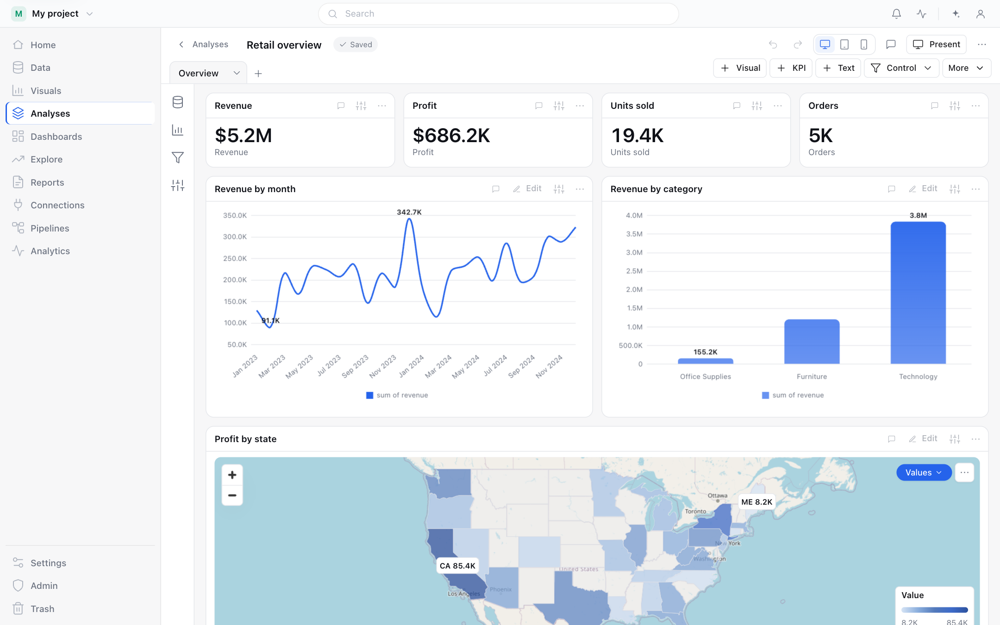
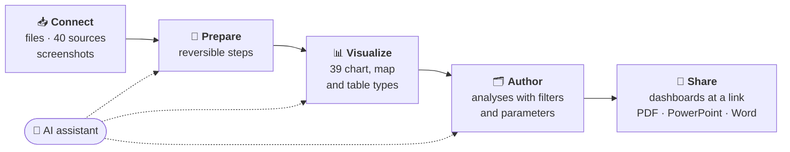
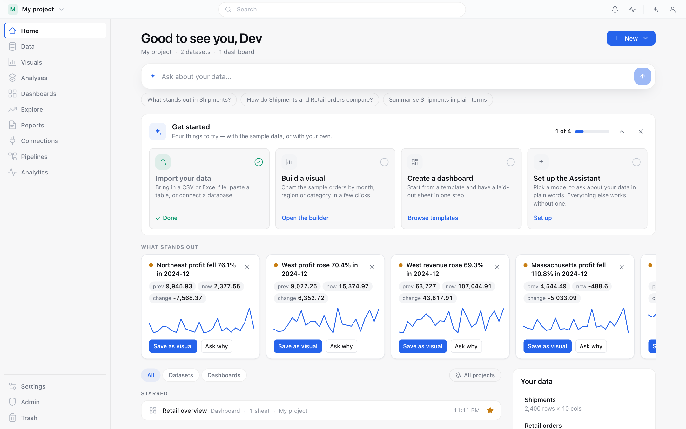
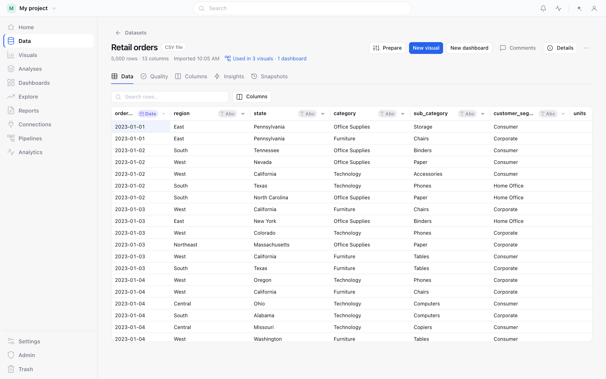
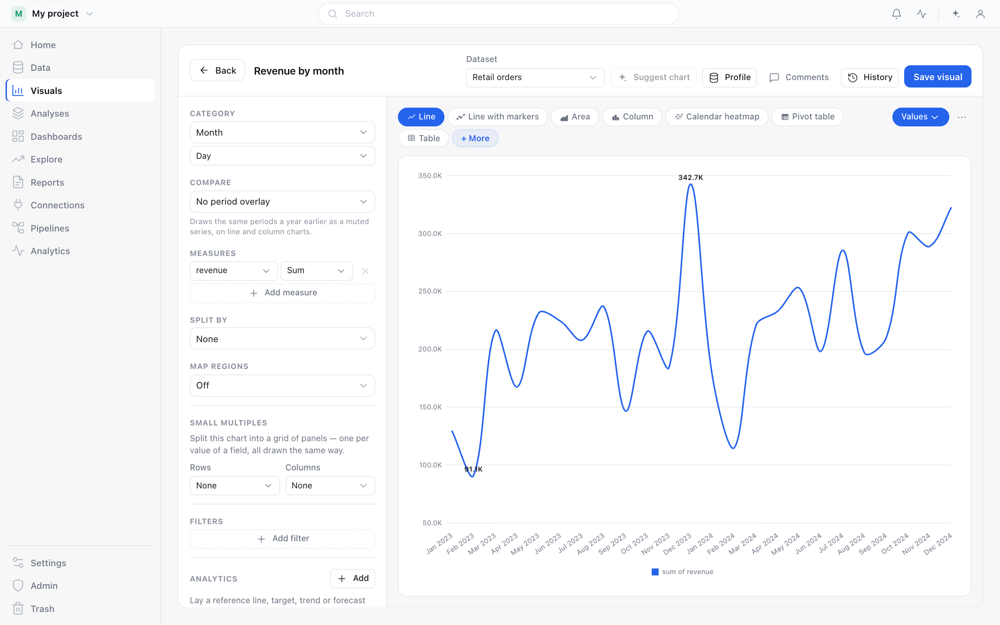
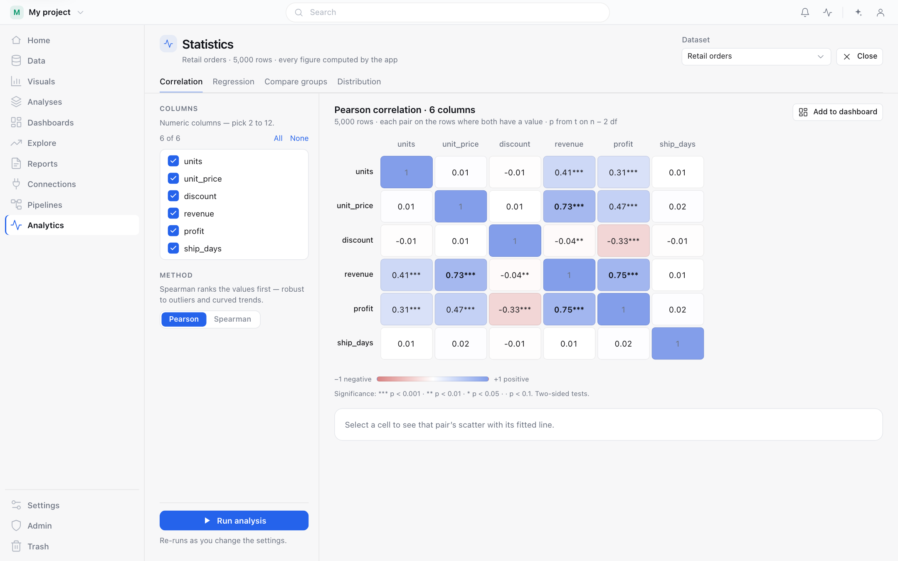
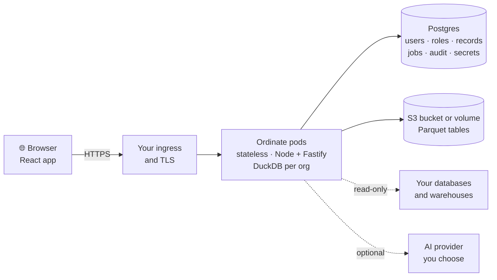

<div align="center">


<br/><br/>

<picture>
  <source media="(prefers-color-scheme: dark)" srcset="assets/icons/ordinate-dark.svg" />
  
</picture>

# Ordinate

### Open-source AI BI you host yourself

Connect your data, build dashboards, and let AI analyse it for you.

<a href="#-quick-start"><b>Quick start</b></a> &nbsp;·&nbsp;
<a href="#-features"><b>Features</b></a> &nbsp;·&nbsp;
<a href="#-connectors"><b>Connectors</b></a> &nbsp;·&nbsp;
<a href="docs/server/README.md"><b>Deploy</b></a> &nbsp;·&nbsp;
<a href="#-documentation"><b>Docs</b></a> &nbsp;·&nbsp;
<a href="SECURITY.md"><b>Security</b></a>

<br/>

<a href="LICENSE"></a>


<br/>


<br/><br/>

<picture>
  <source media="(prefers-color-scheme: dark)" srcset="assets/images/screens/hero-dark.png" />
  
</picture>

</div>

<br/>

## ✨ Why Ordinate

<table>
  <tr>
    <td width="33%" valign="top">
      <h3>🏠 Yours to run</h3>
      One container image, plus your own Postgres and S3 bucket. Deploy with Docker Compose,
      Kubernetes (Helm) or ECS. Your data stays in your infrastructure.
    </td>
    <td width="33%" valign="top">
      <h3>🤖 AI built in</h3>
      Ask questions in plain words, get the changes that stand out explained, and let AI suggest
      charts, prepare steps and whole dashboards. You choose the model, or use none.
    </td>
    <td width="33%" valign="top">
      <h3>📊 The whole BI workflow</h3>
      40 sources, a reversible prepare pipeline, 39 chart, map and table types, and dashboards your
      team opens at a link.
    </td>
  </tr>
  <tr>
    <td width="33%" valign="top">
      <h3>⚡ Live or copied</h3>
      Copy a table into Ordinate, or keep it <b>Live</b> so every chart asks your warehouse and
      shows how fresh the number is.
    </td>
    <td width="33%" valign="top">
      <h3>👥 Built for teams</h3>
      Single sign-on, orgs, teams and per-project roles, an audit log, API tokens and an admin
      console.
    </td>
    <td width="33%" valign="top">
      <h3>🔓 Open source</h3>
      MIT licensed. No telemetry, no account with us, and nothing downloaded at run time.
    </td>
  </tr>
</table>

## 🧭 How it works



Every total, average and trend is calculated by Ordinate or by your warehouse. AI explains those
figures and suggests what to build next; it never makes up a number.

## 🖼️ A quick look

<table>
  <tr>
    <td width="50%" valign="top">
      
      <p align="center"><b>Home</b> — ask about your data, and see what stands out</p>
    </td>
    <td width="50%" valign="top">
      
      <p align="center"><b>Data</b> — every dataset with its quality, columns and history</p>
    </td>
  </tr>
  <tr>
    <td width="50%" valign="top">
      
      <p align="center"><b>Visuals</b> — build any of 39 chart, map and table types</p>
    </td>
    <td width="50%" valign="top">
      
      <p align="center"><b>Analytics</b> — correlation, regression, drivers and more</p>
    </td>
  </tr>
</table>

## 🤖 AI that works with your data

| | |
|---|---|
| **Ask anything** | Type a question on Home or in the Assistant and get an answer built from your datasets. |
| **What stands out** | Notable rises, drops and anomalies are found for you, each with a one-click *Ask why*. |
| **Suggestions** | Suggested charts, prepare steps and calculated fields, plus drafted dashboard layouts. |
| **Plans you approve** | The Assistant proposes multi-step plans, and nothing runs until you say so. |
| **Read a screenshot** | Upload a picture of a table or chart and get an editable dataset back. |
| **Agents and scripts** | An MCP endpoint at `/api/mcp` lets AI agents work with Ordinate using an API token. |

**Admins stay in control.** An admin connects Anthropic, OpenAI, Google Gemini or any
OpenAI-compatible gateway once, in **Admin → AI**, and approves the exact models the team may use.
Everyone else just picks a model from that list; they never see an API key. Keys are encrypted and
never shown again. Setup guide: [docs/server/ai.md](docs/server/ai.md).

Every feature also works with no model at all.

## ⚡ Live or copied data

Each dataset is one of two kinds, and you can switch either way:

| | **Copy** | **Live** |
|---|---|---|
| **Where the rows are** | Imported into Ordinate (up to 1,000,000 rows) | They stay in your warehouse |
| **Who does the math** | Ordinate's own engine | Your warehouse, with SQL Ordinate writes |
| **How fresh** | As of the last refresh, on a schedule you set | As fresh as the cache age you choose, from *always live* to 1 day |
| **Works with** | Every source | Snowflake, BigQuery, Redshift, Databricks SQL, ClickHouse, and a PostgreSQL read replica |
| **Best for** | Preparing, statistics, maps, pivots and row-level tools | Big tables and numbers that must be current |

Every figure says which it is: *As of 1:00 AM*, *Live · 2:05 AM*, or *Stale* when the warehouse
couldn't be reached. Warehouse queries are capped per org per day, and a refresh URL lets dbt or
Airflow tell Ordinate when new data has landed. Details: [docs/server/live-data.md](docs/server/live-data.md).

## 🚀 Quick start

### Run it with Docker Compose

This starts Ordinate with Postgres and MinIO on one machine. You need Docker with Compose v2.

```bash
git clone https://github.com/AshishB2000/ordinate.git
cd ordinate/deploy
cp .env.example .env
cat >> .env <<EOF
ORDINATE_MASTER_KEY=$(openssl rand -base64 32)
POSTGRES_PASSWORD=$(openssl rand -hex 24)
MINIO_ROOT_PASSWORD=$(openssl rand -hex 24)
EOF
docker compose up -d --build
docker compose logs ordinate | grep "setup code"
```

Open **http://127.0.0.1:8080**, enter the setup code, and create the admin account. Add your
teammates in **Admin → People**. The full walk-through is in
[docs/server/quick-start.md](docs/server/quick-start.md).

> [!WARNING]
> **Keep a copy of `ORDINATE_MASTER_KEY`.** Every stored connection password and AI key is encrypted
> under it. Without it they can't be read, even from a good database backup.

> [!NOTE]
> Password sign-in is for trying Ordinate out. Before real use, switch to your company's single
> sign-on: [docs/server/sso.md](docs/server/sso.md).

### Deploy on Kubernetes or ECS

```bash
helm install ordinate deploy/helm/ordinate -n ordinate -f my-values.yaml --wait
```

Step-by-step guides: [EKS](docs/server/eks.md) · [ECS](docs/server/ecs.md) ·
[GKE / AKS](docs/server/gke-aks.md)

<details>
<summary><b>Run from source, for development</b></summary>
<br/>

You need **Node.js 24**.

```bash
git clone https://github.com/AshishB2000/ordinate.git
cd ordinate
npm install && npm --prefix web install
npm run build:web
AUTH_MODE=dev npm run server
```

Open **http://localhost:8080**. `AUTH_MODE=dev` signs you in as a local admin with no database,
and keeps your data in `./data`. It is for development only: accounts, roles and AI setup need
Postgres, so use the Compose stack above to try those.

For UI work, run `npm run dev:web` beside the server for hot reload.

</details>

## 🧩 Features

| | |
|---|---|
| **📥 Bring data in** | Upload CSV, JSON or Excel, paste a table, point at a JSON URL, read a table out of a screenshot, or connect one of **40 read-only sources**. Copy the data, or keep a warehouse table Live. |
| **🧹 Prepare** | A step-by-step pipeline you can reorder or undo: calculated fields, filters, grouping, joins, pivot and unpivot, dedupe, regex, window functions and more. Refreshes and pipelines run on a schedule. |
| **📊 Visualize** | **39 types**: 31 charts, a pivot table, cohort and event-funnel grids, 4 maps and a table. Small multiples, drill-down, annotations, reference lines and forecasts. |
| **🔬 Analyze** | Statistics, key drivers, what-if scenarios, segments, snapshots, events and a SQL workbench. |
| **🗂️ Author and share** | Analyses with sheets, cards, filters and parameters; publish them as dashboards your org opens at a link. Reports, stories and scorecards export to PDF, PowerPoint and Word. Comments and alerts keep the team in the loop. |
| **🛡️ Govern** | Single sign-on, orgs, teams and per-project roles (viewer, editor, admin), an audit log, personal API tokens, an admin console with AI and warehouse-usage controls, and backup and restore. |

## 🔌 Connectors

**40 read-only sources.** ⚡ marks the ones that can also run **Live**.

| Category | Sources |
|---|---|
| **Cloud warehouses** (9) | Snowflake ⚡ · Google BigQuery ⚡ · Amazon Redshift ⚡ · Google AlloyDB · Neon · Supabase · Azure SQL Database · Azure Synapse Analytics · Oracle Autonomous Database |
| **Databases** (14) | PostgreSQL ⚡ · CockroachDB · TimescaleDB · YugabyteDB · Materialize · QuestDB · RisingWave · MySQL · MariaDB · Amazon Aurora (MySQL) · TiDB · PlanetScale · Microsoft SQL Server · Oracle Database |
| **Query engines** (10) | Databricks SQL ⚡ · ClickHouse ⚡ · SingleStore · StarRocks · Apache Doris · Trino · Presto · Elasticsearch · OpenSearch · Apache Druid |
| **Apps and SaaS** (6) | Google Sheets · Airtable · Notion · Stripe · GitHub · HubSpot |
| **Web** (1) | URL / API (JSON) |

Every connector is read-only, and every query is limited on the server. Identifier columns stay
text, so `007`, ZIP codes and long IDs are never turned into numbers. PostgreSQL runs Live only
when you mark the connection as a read replica or a warehouse.

## 🔒 Security

Ordinate runs inside your network, so security is shared:

| **Ordinate takes care of** | **You take care of** |
|---|---|
| Sign-in, sessions, roles and keeping each org's data separate | Your network, ingress and TLS |
| Blocking connectors and AI calls from reaching internal addresses | The pod's cloud permissions |
| Encrypting stored passwords and AI keys, and never sending them to a browser or a log | Your Postgres and bucket, including their backups |
| CSRF protection, a strict content security policy and security headers | Your identity provider and who can sign in |
| Fixing vulnerabilities and shipping patches | Applying those patches |

The image downloads nothing at run time, and Ordinate sends no telemetry. What leaves your
network, and when, is in [PRIVACY.md](PRIVACY.md). The full threat model, with the test behind each
protection, is in [docs/phase-7-web/threat-model.md](docs/phase-7-web/threat-model.md). To report a
vulnerability, see [SECURITY.md](SECURITY.md); please don't open a public issue for one.

## 📚 Documentation

| If you want to… | Read |
|---|---|
| Try it on one machine | [Quick start with Docker Compose](docs/server/quick-start.md) |
| Run it for real | [EKS](docs/server/eks.md) · [ECS](docs/server/ecs.md) · [GKE / AKS](docs/server/gke-aks.md) · [sizing](docs/server/sizing.md) |
| Connect your sign-in | [Single sign-on](docs/server/sso.md) |
| Turn on AI | [AI providers and models](docs/server/ai.md) |
| Connect a warehouse | [Warehouses and live data](docs/server/live-data.md) |
| Look up a setting | [Every environment variable](docs/server/configuration.md) |
| Keep it safe and current | [Backup and restore](docs/server/backup-restore.md) · [upgrades](docs/server/upgrade.md) |
| Automate it | [The MCP endpoint and commands](docs/automation.md) |
| Understand the code | [CLAUDE.md](CLAUDE.md) · [all docs](docs/README.md) |

<details>
<summary><b>🛠️ How it's built</b></summary>
<br/>



| Layer | What it is |
|---|---|
| **Server** | Node 24 and Fastify 5. Every endpoint is a typed RPC call with a validated input and a role check. |
| **Web app** | React 19, Vite, React Router, TanStack Query and Radix, styled with CSS Modules. |
| **Metadata** | Postgres: users, orgs, roles, records with row-level security per org, jobs, audit log and encrypted secrets. |
| **Tables** | Parquet on a volume or S3, queried in place by DuckDB, one locked worker per org. Live datasets are answered by your warehouse. |
| **Live updates and jobs** | Server-sent events, plus a Postgres job queue shared across pods. |
| **Packaging** | One image for amd64 and arm64, a Compose stack, a Helm chart, and Prometheus `/metrics` on its own port. |

Architecture and conventions are in [CLAUDE.md](CLAUDE.md). The decisions and the measurements
behind them are in [docs/](docs/README.md).

</details>

## 🤝 Contributing

Issues and pull requests are welcome. Branch off **`develop`**, and open a PR once CI is green.

```bash
npm test                   # server test suites
npm run test:web           # web unit tests
npm --prefix web run e2e   # end-to-end tests, one per screen
npm run lint               # lint (must be zero findings)
```

---

<div align="center">

[MIT](LICENSE) © Ordinate contributors

<sub><b>Open source.</b> <b>Self-hosted.</b> <b>AI-powered.</b></sub>

</div>
