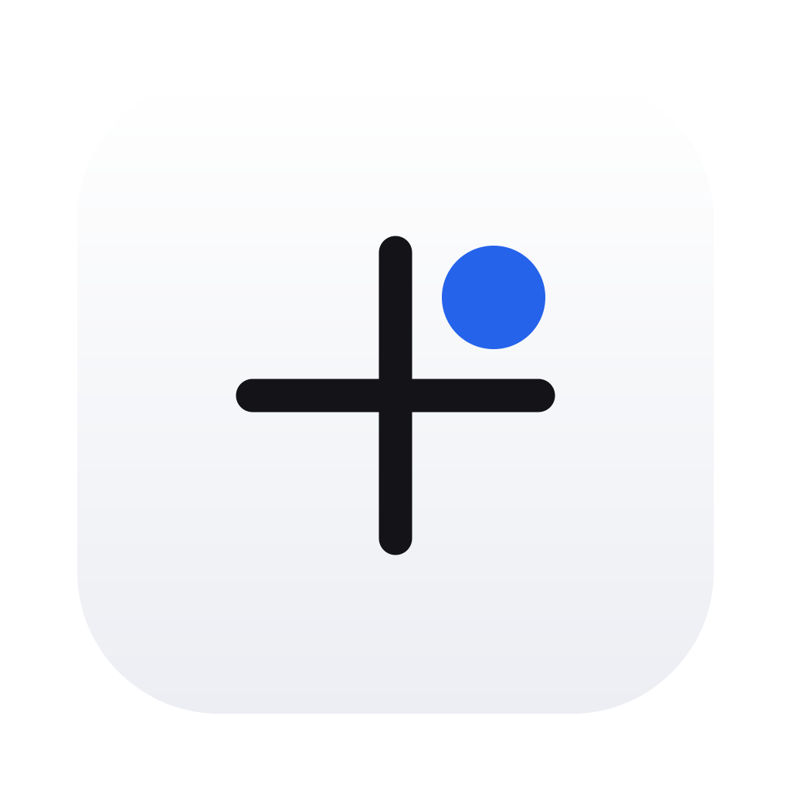
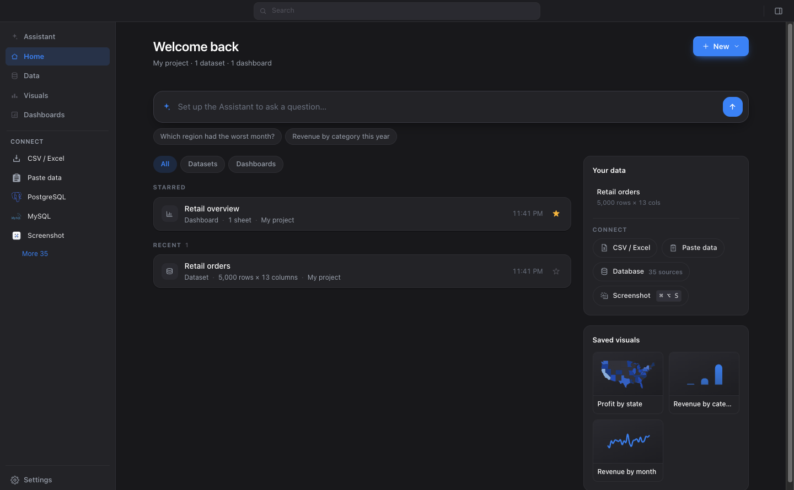
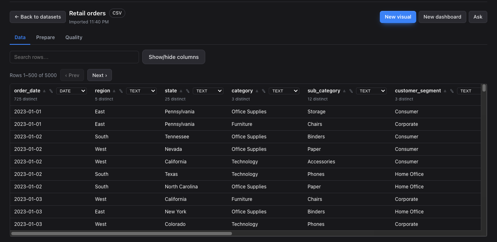
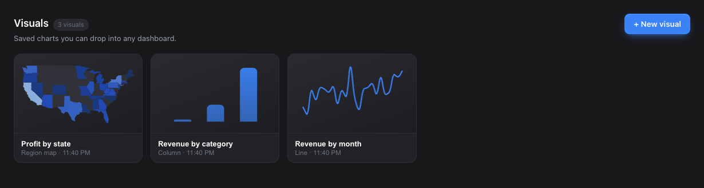
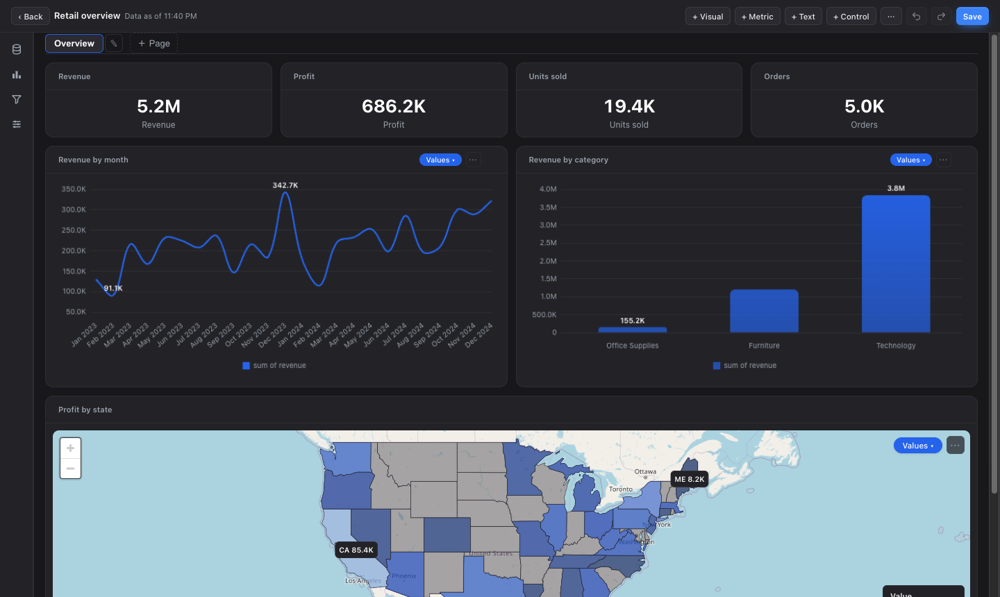
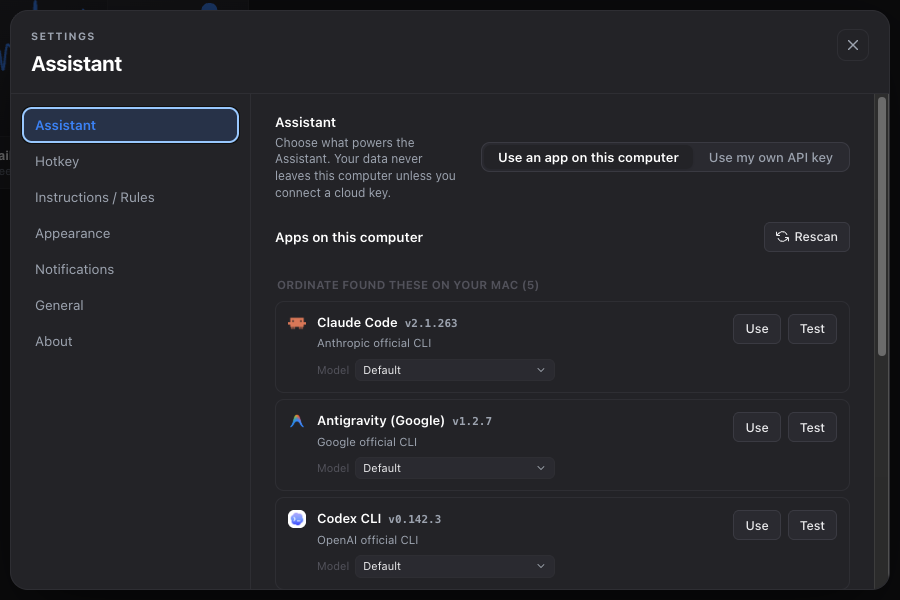

<div align="center">

<picture>
  <source media="(prefers-color-scheme: dark)" srcset="assets/icons/ordinate-dark.svg" />
  
</picture>

# Ordinate

**A local-first, open-source personal BI workspace.**

Bring data in — files, paste, Excel, **35 SQL &amp; HTTP sources**, a URL, or a screenshot.<br/>
**Prepare** it with a reversible pipeline. **Visualize** it across **28 chart &amp; map types**.<br/>
Assemble **dashboards**. **Share** them offline.

<sub>Local-first · model-agnostic · MIT. Your data stays on your machine, and **every number is computed by the app.**</sub>

<br/>

<a href="https://screenchart.app"><b>Website</b></a> &nbsp;·&nbsp;
<a href="https://github.com/AshishB2000/ordinate/releases"><b>Download</b></a> &nbsp;·&nbsp;
<a href="QUICKSTART.md"><b>Quickstart</b></a> &nbsp;·&nbsp;
<a href="https://github.com/AshishB2000/ordinate/discussions"><b>Discussions</b></a> &nbsp;·&nbsp;
<a href="https://github.com/AshishB2000/ordinate/issues"><b>Issues</b></a>

<br/>

<a href="https://github.com/AshishB2000/ordinate/releases"></a>
<a href="LICENSE"></a>


<br/>


<sub>The bundled sample dashboard. Every figure on it was computed by the app.</sub>

</div>

---

## What is Ordinate

Ordinate is a **personal business-intelligence workspace that runs entirely on your machine.** You organize work into **projects**, bring **data** in from many sources, **prepare** it with a reversible transform pipeline, build **visuals**, assemble them into **dashboards**, and **share** them offline.

AI is available at every step, is **completely optional**, and even when it is on, **the app computes every number itself.**

> [!IMPORTANT]
> **The app does the math.** All aggregation, statistics, metrics and anomaly detection run in pure code. A model may *extract structure* (a table out of a screenshot) or *narrate figures the app already computed* — it is **never** the source of a number.

|  | Step | What you get |
|:--:|---|---|
| 📥 | **Bring in** | CSV / JSON / Excel files, pasted tables (TSV/CSV/JSON auto-sniffed), **35 read-only SQL &amp; HTTP sources**, an https JSON API, local DuckDB / Parquet / CSV folders, or a **screenshot** of anything on screen. |
| 🧹 | **Prepare** | A reversible, ordered pipeline: calculated fields, filters, group &amp; aggregate, dedupe, fill, trim, rename, drop, combine. Remove any step and the result recomputes from the original source. |
| 📊 | **Visualize** | **28 chart &amp; map types** — 25 charts, 2 maps, and a table view — with per-shape eligibility so you see the ones that actually fit. |
| 🗂️ | **Assemble** | Multi-page dashboards on a 12-column grid: visual cards, computed metric cards, text, and filter controls that cross-filter every card, including across datasets. |
| 📤 | **Share** | Self-contained offline HTML, PNG or PDF; a single result to PDF, Word or PowerPoint; or commit the project's plain-JSON folder to git. |

---

## See it in action

https://github.com/user-attachments/assets/8d0a13db-bc9f-463f-a849-7ca74f77af54

---

## Product tour

<table>
<tr>
<td width="50%" valign="top">
<br/>
<sub><b>Start anywhere</b> — Home opens on one ask bar, what you touched last, and the connectors you actually use. Saved visuals render as live thumbnails, not placeholders.</sub>
</td>
<td width="50%" valign="top">
<br/>
<sub><b>Bring in &amp; prepare</b> — the dataset page is where work starts: every column carries its declared type and distinct count, Prepare and Quality sit one tab away, and the next step is one button.</sub>
</td>
</tr>
<tr>
<td width="50%" valign="top">
<br/>
<sub><b>Visualize</b> — a visual is a dataset plus an encoding, a chart type and a style, saved once and droppable into any dashboard.</sub>
</td>
<td width="50%" valign="top">
<br/>
<sub><b>Assemble &amp; share</b> — metric, chart, text and filter-control cards on a 12-column grid, maps included. Export the result as offline HTML, PNG or PDF.</sub>
</td>
</tr>
</table>

---

## Data sources

**35 read-only connectors**, one registry entry each. Wire-compatible engines share a driver, so a Postgres-protocol warehouse is a first-class entry rather than a checkbox on "Postgres".

<table>
<tr><th align="left" width="180">Category</th><th align="left">Sources</th></tr>
<tr>
<td valign="top"><b>Databases</b><br/><sub>14</sub></td>
<td>PostgreSQL · CockroachDB · TimescaleDB · YugabyteDB · Materialize · QuestDB · RisingWave · MySQL · MariaDB · Amazon Aurora (MySQL) · TiDB · PlanetScale · Microsoft SQL Server · Oracle Database</td>
</tr>
<tr>
<td valign="top"><b>Cloud warehouses</b><br/><sub>7</sub></td>
<td>Amazon Redshift · Google AlloyDB · Neon · Supabase · Azure SQL Database · Azure Synapse Analytics · Oracle Autonomous Database</td>
</tr>
<tr>
<td valign="top"><b>Query engines</b><br/><sub>10</sub></td>
<td>SingleStore · StarRocks · Apache Doris · ClickHouse · Databricks SQL · Trino · Presto · Elasticsearch · OpenSearch · Apache Druid</td>
</tr>
<tr>
<td valign="top"><b>Files &amp; local</b><br/><sub>4</sub></td>
<td>DuckDB database file · Parquet folder · CSV folder · URL / API (JSON)</td>
</tr>
</table>

Three rules hold across all of them: **read-only**, **secrets never leave the main process**, and **every query is bounded server-side** — the row limit is part of the dialect's own SQL, not a wrapper bolted on afterwards.

Plus the sources that need no connection at all:

| Source | What it does |
|---|---|
| **File import** | Native picker for **CSV, JSON or XLSX**. CSV uses a real RFC-4180 parser (quoted fields, embedded commas/newlines, CRLF/LF). XLSX is read-only, one sheet at a time, with a sheet picker. |
| **Paste** | Paste a table; Ordinate auto-detects JSON vs delimited and sniffs tab vs comma, so **TSV works via paste** even though there is no `.tsv` file-open option. |
| **Screenshot capture** | Press <kbd>⌘</kbd><kbd>⌥</kbd><kbd>S</kbd> (macOS) or <kbd>Ctrl</kbd><kbd>Alt</kbd><kbd>S</kbd> (Windows), drag a box around on-screen data, and a vision model extracts a table you review, edit and save — with a link back to the crop. |
| **Combine** | Build a new dataset by appending (union of columns) or inner-joining two existing datasets on a key. |
| **Refresh** | Any connected source can be re-pulled on demand or on a schedule, re-running the same bounded query. |

> [!NOTE]
> **Identifier columns are protected everywhere.** `007`, ZIP codes and IDs longer than 15 digits stay text and are never coerced into figures — in the parser, in the SQL fast paths, and in every aggregate.

**Ceilings:** 1,000,000 rows per dataset, and 512 MB per imported file (checked before a byte is read, so an oversized file is refused rather than crashing the app).

---

## Visualizations

**28 types** in total — **25 charts, 2 maps and a table view.** Ordinate picks one that fits your data and you can switch from the `⋯` menu. Grouped data supports Values/Periods toggles and small multiples where they fit.

| Group | Types |
|---|---|
| **Bar &amp; column** | Column · Clustered column · Stacked column · 100% stacked column · Bar · Clustered bar · Stacked bar · 100% stacked bar |
| **Line &amp; area** | Line · Line with markers · Area · Stacked area · Line + column (combo) |
| **Part-to-whole** | Pie · Donut · Treemap · Funnel |
| **Distribution &amp; relationship** | Scatter · Bubble · Histogram · Box plot · Heatmap |
| **Flow &amp; finance** | Sankey · Candlestick |
| **Single value / tabular** | Gauge · Table |
| **Maps** | Region map (choropleth) · Bubble map |

Charts render with **Chart.js 4** (plus the treemap, sankey, matrix, financial and boxplot plugins). Maps render with **MapLibre GL** over OpenStreetMap tiles, at country, US state, US county, US city and US ZIP levels. Chart eligibility is filtered per data shape, so you normally see the subset that fits rather than all 25 at once.

---

## Analyses &amp; dashboards

Dashboards follow a QuickSight-style split:

- An **analysis** is the mutable authoring surface — sheets of cards, a properties rail, drag-and-drop layout and resize handles.
- A **published dashboard** is a read-only snapshot, copied **by value** at publish time, so editing the analysis afterwards never moves a dashboard someone is already reading.

Cards come in four kinds: a saved **visual**, a **computed metric** (its one number produced in the main process, never stored and never written by a model), free **text**, and a **filter control** (dropdown, multi-select or date range) that cross-filters every card on every page.

Editing is direct manipulation: drag a card by its header, resize it from the right, bottom or corner handle, and nudge or resize with the arrow keys — or reach move, resize and remove from the card's `⋯` menu. <kbd>⌘</kbd><kbd>Z</kbd> and <kbd>⇧</kbd><kbd>⌘</kbd><kbd>Z</kbd> undo and redo the last fifty changes, and the Undo button names the change it will reverse. Everything autosaves.

---

## The Assistant is optional

The entire workspace — import, prepare, explore, visualize, dashboard, export — works with **no model configured at all.** Connect one and the Assistant becomes help, never a source of numbers:

- **Ask the Assistant** — a per-project conversation that answers against app-computed facts about your datasets, visuals and dashboards, and is instructed to narrate figures rather than recompute them. Hard on/off switch.
- **Suggestions** — propose transform steps, a calculated field, or a chart for a dataset.
- **Dashboard help** — draft a layout, write an executive summary, explain anomalies.
- **Anomalies** are found by a **pure code detector** (outliers, dominant categories, empty-heavy or constant columns, period-over-period swings). The model only puts the app's findings into words.

With nothing set up, every Assistant surface says so in one sentence and offers one **Set up the Assistant** button rather than naming a screen to go find.

### Two ways to power it

Ordinate never ships or installs a model. It **runs a local CLI you already have**, or calls a **cloud API with your own key**. Pick in **Settings → Assistant**.

<div align="center">


<sub>Detected on this machine — Ordinate finds them, it never installs them.</sub>
</div>

#### 🖥️ Use an app on this computer — detect &amp; run only, never install

Ordinate detects agent CLIs already on your `PATH` and runs them shell-free, with an args array. It **never** runs `npm` / `brew` / `curl` install; the Install button only opens the vendor's page.

| Local CLI | Vendor |
|---|---|
| [Claude Code](https://docs.anthropic.com/en/docs/claude-code/overview) | Anthropic |
| [Antigravity](https://antigravity.google) | Google |
| [Codex CLI](https://github.com/openai/codex) | OpenAI |
| [Grok CLI](https://github.com/superagent-ai/grok-cli) | xAI (community) |
| [OpenCode](https://opencode.ai) | opencode.ai (BYOK) |
| [Cursor Agent](https://cursor.com/cli) | Cursor (Anysphere) |

#### 🔑 Use my own API key

Stored per provider on your machine — plaintext in `userData/config.json`, gitignored, never logged and never sent to a renderer. See [PRIVACY.md](PRIVACY.md).

| Family | Endpoints |
|---|---|
| **Anthropic** | Claude API |
| **OpenAI** | OpenAI API |
| **Gemini** | Google Gemini API |
| **Gateway** | Any OpenAI-compatible endpoint — OpenRouter, Ollama, LM Studio, or a custom URL |

---

## Why Ordinate

Your data lives in a dozen places: a CSV export, a spreadsheet, a Postgres table, an internal API, a chart trapped in a slide. The usual options are all bad. A cloud BI tool wants your data on its servers and a subscription. A cloud chatbot may invent the numbers. Re-typing into a spreadsheet is slow and wrong.

- 🔒 **Local &amp; private.** No accounts, no telemetry, no analytics, no crash reporting, no auto-updater. The only declared external fetches are the model endpoint you chose (or a fully local CLI) and OpenStreetMap tiles — and tiles only when a map is on screen.
- 🧮 **Number-accurate by design.** Aggregation, statistics, metrics and anomaly math live in pure main-process code, cross-checked by differential tests that assert the fast path and the reference implementation agree exactly. A model is **forbidden** from writing a computed number.
- 🔑 **Secrets never leave the main process.** Database passwords and URL tokens live only in gitignored config, are stripped from connection metadata and error strings, and never reach a renderer, a shareable project folder or an export.
- 🤝 **Yours to keep and share.** Projects are plain files on disk. Export a dashboard as offline HTML, PNG or PDF; a result to PDF, Word or PPT; or commit the project folder to git.
- 🤖 **Model-agnostic and optional.** The `claude` / `codex` / `cursor-agent` already on your `PATH`, or any cloud API via your own key, or nothing at all.

|  | Spreadsheet | Cloud BI tool | Cloud AI chatbot | **Ordinate** |
|---|:---:|:---:|:---:|:---:|
| Runs locally / private | ✅ | ❌ | ❌ | **✅** |
| Numbers computed by the app, not guessed | you do it | ✅ | ❌ | **✅** |
| Many data sources (files / DB / URL / screenshot) | limited | ✅ | ❌ | **✅ 35+** |
| Reversible prepare pipeline | manual | ✅ | ❌ | **✅** |
| Dashboards with cross-filters | limited | ✅ | ❌ | **✅** |
| Offline / self-contained export | ✅ | ❌ | ❌ | **✅** |
| AI is optional and add-on | — | rarely | required | **✅** |
| Open source | — | ❌ | ❌ | **✅ MIT** |

---

## Quick start

> [!WARNING]
> **Why does my OS warn about this app?** Ordinate is free and open source and isn't signed with a paid code-signing certificate, so macOS and Windows show a one-time security prompt on first launch. That reflects the missing certificate, not the app's safety — the full source and build pipeline are public and checksums ship with every release. Use the first-launch steps below, or skip the prompt entirely by [running from source](#-run-from-source).

### 🧑‍💻 Run from source

Recommended if you have git: no installer, no first-launch security prompt.

```bash
git clone https://github.com/AshishB2000/ordinate.git
cd ordinate
npm install          # postinstall fetches map GeoJSON
npm start
```

Requires [Node.js](https://nodejs.org/) 20+ and npm. `npm start` compiles the TypeScript (`npm run build:ts`, run automatically) and launches Electron — **no bundler**. Installers are built with electron-builder (`npm run dist:mac` / `npm run dist:win`).

### 🖥️ Download the app

- **macOS** — Apple Silicon + Intel, universal → [Download](https://screenchart.app/download)
- **Windows** — x64 → [Download](https://screenchart.app/download)
- **Linux** — planned.

<details>
<summary><b>macOS — first launch (unsigned build)</b></summary>
<br/>

The build isn't signed with a paid Apple certificate, so macOS blocks it on first open. You only do this once:

1. Double-click **Screenchart**; you'll see *"could not verify."* Click **Done**.
2. Open **System Settings → Privacy &amp; Security**.
3. Scroll to the message about Screenchart and click **Open Anyway**.
4. When it prompts again, click **Open Anyway**, then authenticate.

It opens normally afterwards. Screen Recording setup (needed for screenshot capture) is in [QUICKSTART.md](QUICKSTART.md).

</details>

<details>
<summary><b>Windows — first launch (unsigned build)</b></summary>
<br/>

The installer isn't signed with a paid certificate, so SmartScreen warns about the download. Click **More info → Run anyway**.

</details>

<details>
<summary><b>Why the app is still called "Screenchart"</b></summary>
<br/>

Screenchart was the original product; screenshot capture is now just one data source among many. The macOS bundle and the `userData` directory keep the old name on purpose — renaming them would orphan every existing project, config and history file, which is a migration rather than a rename. That is also why the macOS permission panel and notifications still say Screenchart: those name rows in System Settings.

</details>

### First steps

1. Create a **project**.
2. **Bring in data** — import a file, paste a table, connect a database, fetch a URL, or capture a screenshot.
3. **Prepare** it — add transform steps, review the column stats, fix the quality flags.
4. Save a **visual**, place it on a **dashboard**, add metric, text and filter-control cards.
5. **Share** — export to HTML / PNG / PDF, export a result to PDF / Word / PPT, or commit the project folder.
6. Optionally set the Assistant up in **Settings → Assistant** to unlock Ask and the suggestions.

---

## Under the hood

A **project** is one directory on disk (`userData/projects/<id>/`). Records are metadata-only JSON; table data lives beside them as **Parquet** — 500k rows is roughly 0.3 MB. Every id is a UUID validated before it touches a path, writes are atomic (temp file, then rename), and a corrupt file is skipped rather than fatal, so a project folder stays safe to sync or commit.

| Layer | What it is |
|---|---|
| **Engine** | **DuckDB** (`@duckdb/node-api`, prebuilt N-API) behind a synchronous bridge — DuckDB runs in a worker and the main thread waits on a `SharedArrayBuffer` |
| **Storage** | **Parquet** per dataset, plus an immutable source copy so the prepare pipeline can always recompute |
| **Queries** | Stats, metrics, paging and anomaly detection query the stored Parquet **in place** — no table is materialised to answer a question |
| **Charts** | **Chart.js 4** on Canvas 2D |
| **Maps** | **MapLibre GL 4** (vector, GPU) over OpenStreetMap tiles |
| **Shell / UI** | **Electron** + TypeScript, compiled with `tsc` to sibling `.js` — no bundler |

Each fast path returns `null` on any failure and the caller falls back to the pure-JS reference implementation, so a broken fast path is slow rather than wrong. Every one is paired with a *differential* test asserting the two agree exactly.

Two things are **built but deliberately off**: a [Mosaic](https://github.com/uwdata/mosaic)/vgplot rendering path (queries already run in ~12 ms, so Chart.js was never the bottleneck) and a Svelte toolchain spike. A Tauri shell was costed and closed. The measurements behind each decision are written up in [`docs/`](docs/).

Architecture and internals → [CLAUDE.md](CLAUDE.md) · Analysis model → [`docs/analysis/00-model.md`](docs/analysis/00-model.md)

---

## Platform notes

**macOS — Screen Recording permission.** Screenshot capture needs **Screen Recording**, or captures come back **black**. On first capture, grant it in **System Settings → Privacy &amp; Security → Screen Recording**, then relaunch. In dev you grant it to whatever launches Electron (your terminal, or `Electron.app`), not "Screenchart"; that applies once packaged. No other data source needs a permission.

**Windows.** The default capture hotkey is <kbd>Ctrl</kbd><kbd>Alt</kbd><kbd>S</kbd> (configurable). Captures are cropped from the actual returned bitmap resolution, so selections stay accurate under 125–150% display scaling.

---

## Privacy

Local-first is a core promise. Projects, datasets, dashboards, history and settings stay on your machine. When you use the Assistant, analysis goes to **the model you chose** — a local CLI process, or your own cloud endpoint over HTTPS — and nowhere else. No telemetry, no analytics, no crash reporting, no auto-updater. OpenStreetMap tiles are the one declared external fetch, only when a map renders; URL sources are https-only.

**Secrets never leave the main process.** Database passwords and URL bearer tokens are stored in gitignored `userData/config.json`, stripped from connection metadata (including inline URL userinfo) and from error strings, never returned to a renderer, and never written into a shareable project folder or an export. Dashboard exports are sanitized field by field down to labels, numbers, strings and embedded `data:` image URIs.

Full details → [PRIVACY.md](PRIVACY.md).

---

## Contributing

Issues and PRs welcome. New work goes on a branch off **`develop`** and merges via PR once CI is green; conventions are in [CLAUDE.md](CLAUDE.md). File bugs and feature requests through the [issue templates](https://github.com/AshishB2000/ordinate/issues/new/choose); ask questions in [Discussions](https://github.com/AshishB2000/ordinate/discussions).

```bash
npm start      # run the app
npm test       # every self-check suite, in parallel
npm run lint   # oxlint — blocking, zero findings
npm run smoke  # launch the REAL app and drive it with Playwright
```

<details>
<summary><b>Developer scripts</b></summary>
<br/>

Helper scripts live in the screenchart-dev skill at [`.claude/skills/screenchart-dev/scripts/`](.claude/skills/screenchart-dev/scripts/) (POSIX bash):

| Script | What it does |
|---|---|
| `check-prereqs.sh` | Verify the build env: Node 20+, npm, authenticated `gh`, electron-builder |
| `setup-workspace.sh` | Bootstrap a fresh clone (prereqs + `npm install`) |
| `create-pr.sh` | Push the current branch and open a PR |
| `create-issue.sh` | Open a GitHub issue in `AshishB2000/ordinate` |

```bash
bash .claude/skills/screenchart-dev/scripts/setup-workspace.sh
```

</details>

---

<div align="center">

[MIT](LICENSE) © Ordinate contributors

<sub><b>Local-first.</b> <b>Model-agnostic.</b> <b>The app does the math.</b></sub>

</div>
