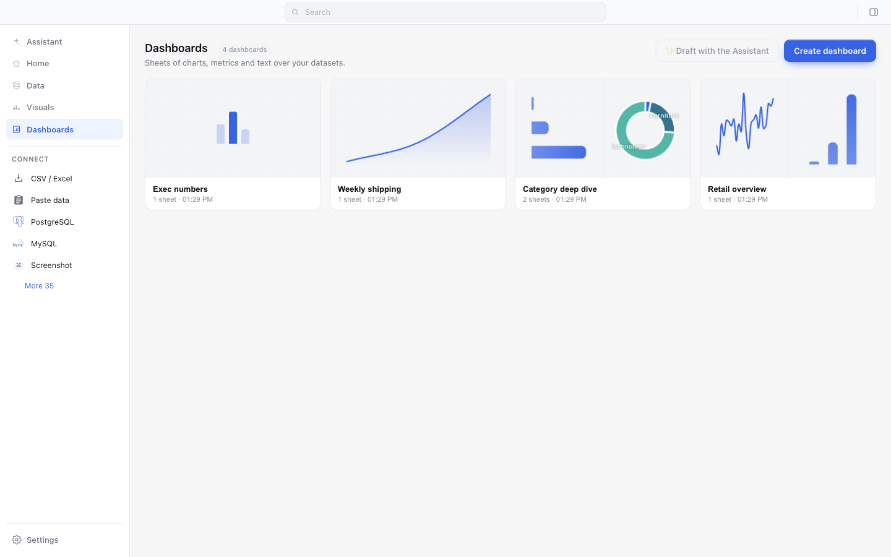
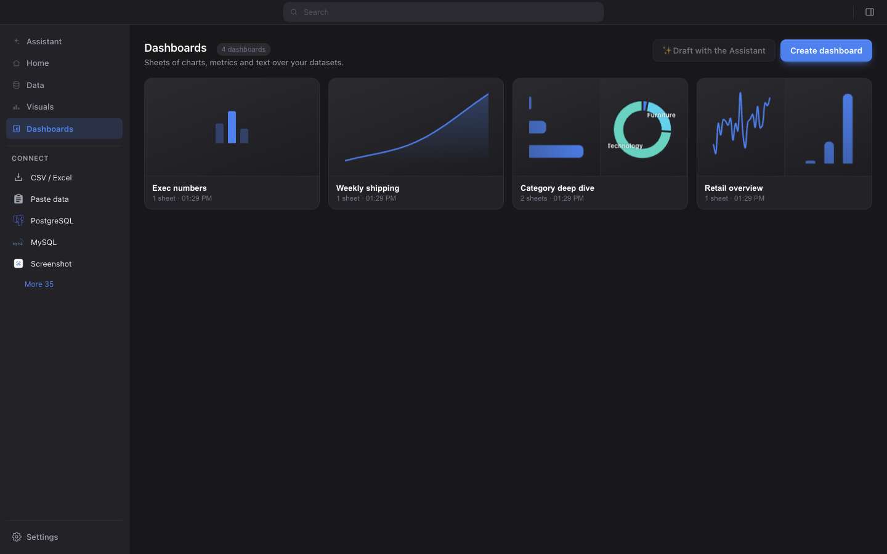
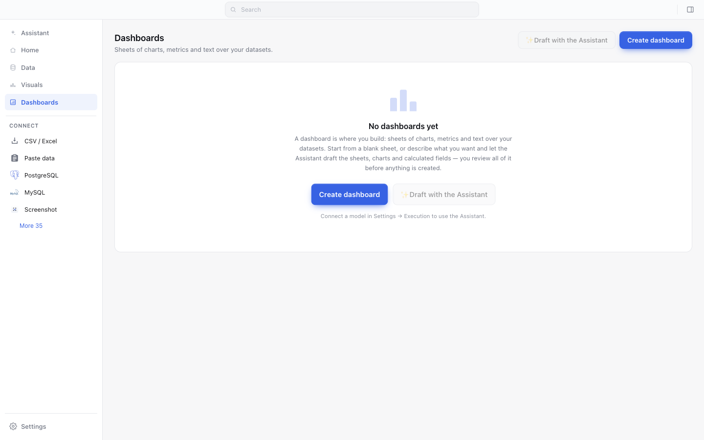

# The Dashboards list — cards with live previews

Screenshots from the real app (fresh `--user-data-dir`, 1440×900), captured at
PR time. Same pattern as `docs/ask-redesign/` and `docs/dock-redesign/`.

The populated shots are the bundled sample project with three more dashboards
seeded alongside "Retail overview", so the grid reads as a grid and so every
preview case is on screen at once.

| | Light | Dark |
|---|---|---|
| **The list** |  |  |
| **Empty state** |  | — (unchanged) |

## What changed

The three list sections did not agree, and the odd one out was the app's
flagship output. Visuals is a card grid where every card renders a real small
chart from live data. Data is a table, which is right — a dataset *is* rows.
Dashboards was a bare four-column text table (Name / Sheets / Last updated /
Action), so the one record in the app that is mostly *pictures* had the plainest
surface in the product.

It is now the same card: the first sheet's first one or two visuals, drawn small,
then the name, the sheet count and when it last changed.

## What to look at

**There is no second thumbnail engine.** The previews go through
`renderer/hub/vizThumbs.ts` — the Visuals gallery's engine, which `homeData.ts`
already reuses for the Home strip. Each preview tile is literally a
`.viz-card-tile`, so the glyph fallback, the deterministic per-type accent, the
lazy `IntersectionObserver` render, the three-at-a-time concurrency cap and the
destroy-every-Chart-on-repaint discipline all arrive for free. `anList.ts` adds
the strip and the two fetches a card needs; it adds no rendering.

**"Category deep dive" and "Retail overview" preview two visuals.** The strip
owns the 16/9 aspect ratio rather than the tiles, so a two-up card is exactly as
tall as a one-up card; the tiles share a hairline.

**"Exec numbers" keeps a glyph** — its first sheet holds metrics only, so there
is nothing to draw and it gets the section's own bar motif rather than borrowing
a chart glyph for a chart it does not have. A sheet whose visuals are all *maps
or tables* keeps a glyph too, for the reason `VIZ_THUMB_SKIP` already gives:
MapLibre needs WebGL2 and the visible window, and a shrunken table is
unreadable. Any fetch or render failure lands in the same place, silently — a
broken card is worse than a plain one.

**"Retail overview" previews the line and the column chart, not the map.** The
sample's third visual is a `map_choropleth`, and it is simply never observed.

**The ⋯ menu and open-on-click survived the reskin.** The card body is one
button (one Tab stop) and the ⋯ trigger is a sibling positioned over the
preview, wearing the gallery's own `.viz-card-menu` chip — the same
hover-and-focus reveal rule, extended rather than copied.

**The empty state is untouched.** It was already the good one; the table it sat
next to was the problem.
