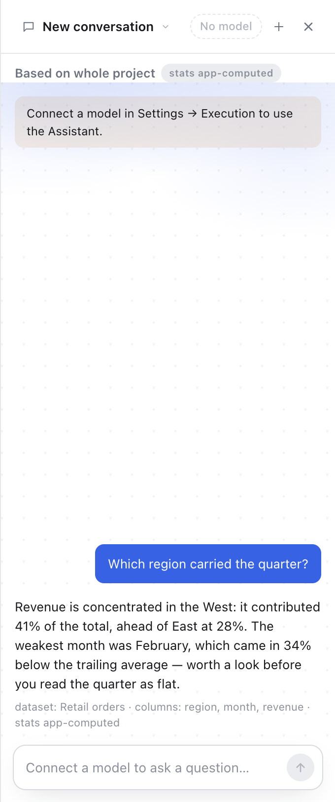
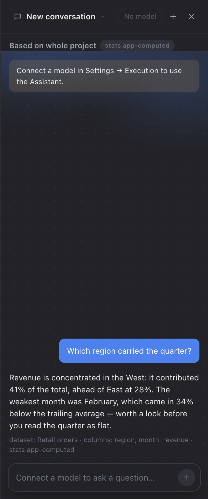

# The Assistant dock — the stage

Screenshots from the real app (fresh `--user-data-dir`, 1440×900, dock at its
default 340px), captured at PR time. Same pattern as `docs/ask-redesign/`.

No model is configured in these runs, which is why the panel carries its
"Connect a model in Settings → Execution" notice — the notice sits *on* the
stage, which is part of what is under test.

| | Light | Dark |
|---|---|---|
| **Empty conversation** |  |  |
| **Two turns of transcript** |  |  |

## What to look at

**The stage is the whole scrolling body.** The retired Assistant page's
`.xp-stage` (`git show 40bff73^:renderer/hub/hub.css`, ~line 9981): three accent
washes over a 22px dot lattice, now on `.dk-messages`. It is a `scroll`-
attachment background on a scroll container, so the lattice stays put while the
bubbles travel over it — visible behind the transcript in the second row.

**The washes were retuned for the panel.** The page's stage was wide and short
and grounded itself with a wash rising off the *bottom* edge. A dock is ~340px
wide and window-tall, so all three sit at the top instead — two soft blooms in
the corners and the stronger `--accent-line` centred just above the top edge, so
only its faded tail shows — and every one reaches alpha zero by about a quarter
of the way down, well clear of the composer.

**The dark rule restates `background-size` and `background-repeat`.** The
`background` shorthand implicitly resets them, and this rule out-specifies the
base one; without those two lines the dark lattice silently becomes a single
element-sized gradient — no dots, no error. `scripts/smoke-dockHero.ts` reads
both themes back for exactly that reason.

The dark base is `--surface`, where the page used `--bg`. That rule was "do not
glow brighter than the app you sit in", and what this stage sits in is the
*panel*, which is `--surface`; `--bg` is darker than the dock's own chrome and
drew the body as a recessed rectangle between a lighter header and a lighter
composer strip — a seam light does not have.

**No hero.** An earlier pass put the page's logo/greeting block into the dock
instead of its stage; that markup and CSS are gone. The starter chips are the
only thing an empty conversation shows, pinned just above the composer and
centred so they read as chips rather than three more input boxes stacked over
the real one.
