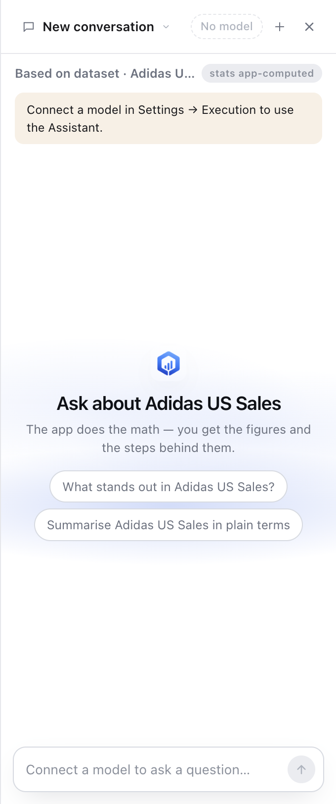
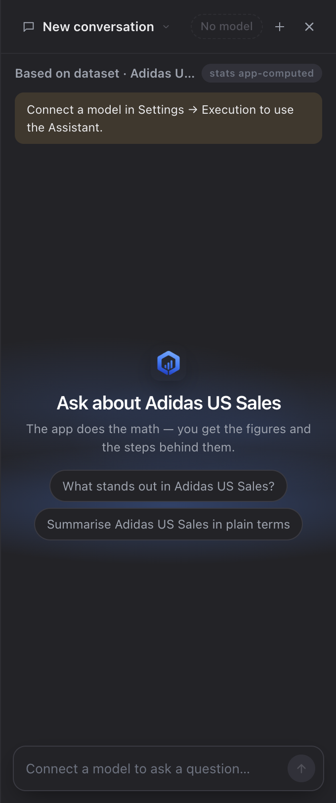
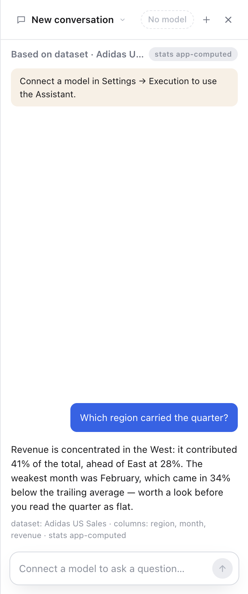
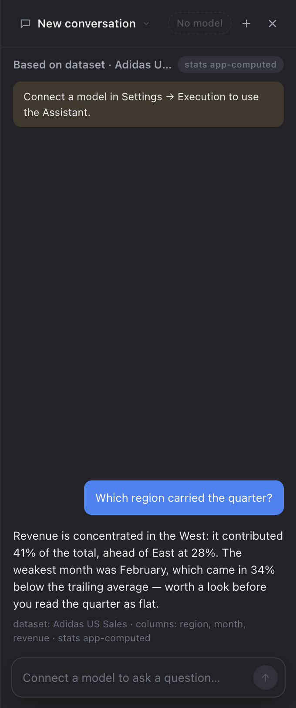
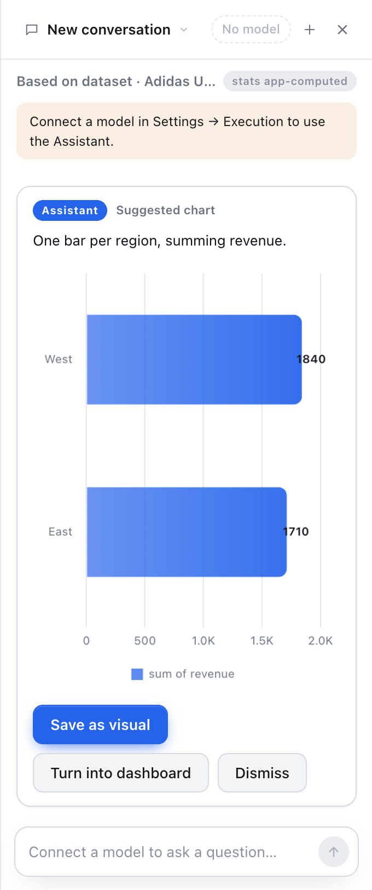
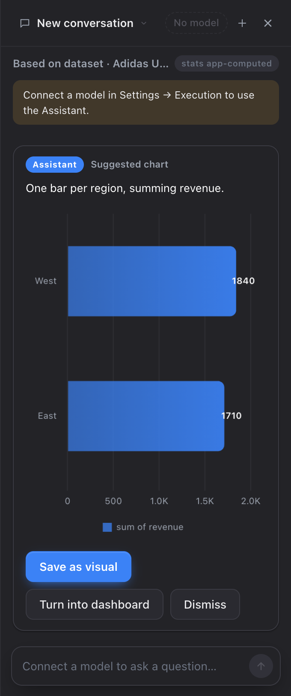

# The Assistant dock — the leaked action line, and the missing design

Screenshots from the real app (`--user-data-dir` fresh, 1440×900, dock at its
default 340px), captured at PR time. Same pattern as `docs/ask-redesign/`.

No model is configured in these runs, which is why the panel carries its
"Connect a model in Settings → Execution" notice — the design is what is under
test, not an answer.

| | Light | Dark |
|---|---|---|
| **Empty / new conversation** |  |  |
| **After one answer** |  |  |
| **After a proposal** |  |  |

## What to look at

**Empty.** The mark, a context-aware greeting ("Ask about Adidas US Sales" — a
dataset is open), one sub line, and starter chips built from the project's real
dataset names by the same generator Home's ask bar uses. The wash is full-bleed
and fades to nothing at both edges; a rounded card here read as a second object
competing with the composer, and its corners cut the bottom gradient off
mid-fade in dark.

**After one answer.** The user's turn keeps its right-aligned accent bubble; the
answer is plain text on the panel, not a facing bubble. Provenance is one small
muted line, not two pills that looked like buttons. The conversation hangs from
the composer rather than the header.

**After a proposal.** The card keeps its structure and takes the dock's tokens
(`--surface`, `--border-2`, `--r-lg`, `--shadow-sm`). The dark chart's axis is
legible here because the card is now mounted before the chart is drawn — see the
commit; `getCSSVar(name, canvas)` returns `''` on a detached element and Chart.js
was falling back to `#666`.
