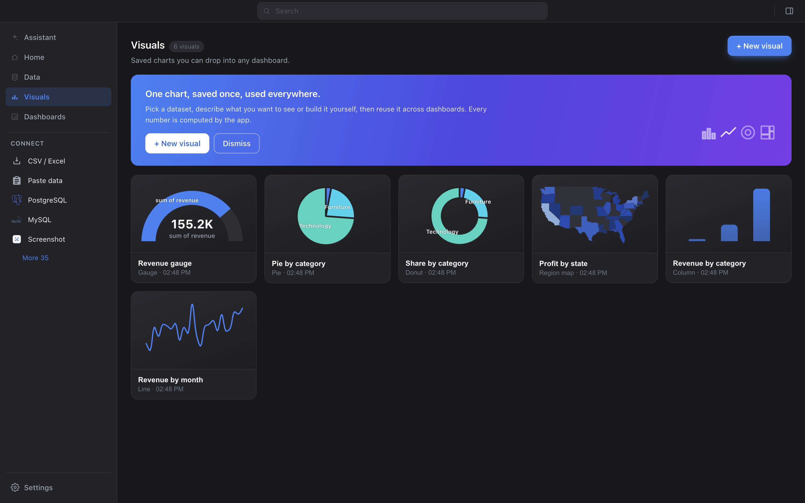
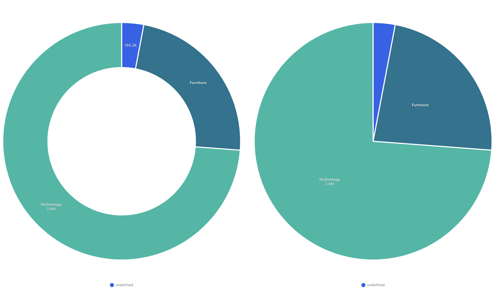

# Round-chart labels: fit the slice, at any size

The Visuals gallery and the Dashboards cards render real miniatures. On a ~150px
tile the donut and pie drew their category names straight across the ring and out
the other side, because the rule for "is this slice big enough to label" was
`frac >= 0.06` — a share of the TOTAL, which says nothing about pixels.

| | Light | Dark |
|---|---|---|
| **Before** — tiles |  |  |
| **After** — tiles |  |  |

Look at "Pie by category" and "Share by category": before, *Furniture* and
*Technology* cross their own slice edges; after, the tiles are clean shapes and
the categories come from the legend, exactly as the plugin's own comment always
promised ("small slices fall back to the legend").

## Full size does not go quiet

The risk in a rule like this is suppressing labels people rely on. It does not:

| Before | After |
|---|---|
|  |  |

The donut is **identical**. The pie loses exactly one label — the sliver's
`155.2K`, which in the before shot is visibly clipped and spilling across the
wedge boundary. That is the bug, at full size, rarer.

## Why the first attempt was not enough

The first pass compared the text width to the slice's chord at the label radius.
That is rotation-independent, and the label is not — it is drawn horizontally, so
a slice at 4 o'clock has far less left-to-right room than its chord suggests. It
fixed the pie and left the donut exactly as broken.

What settles it is the label's own box: the text is a rectangle centred on the
slice's mid-radius, mid-angle point, and it fits when all four corners are still
inside the annular sector — radius within `[inner, outer]`, angle within
`[start, end]`. Orientation-aware by construction, and no tolerance to tune.

One consequence worth knowing: a thin wedge keeps its label where the text runs
*outward along* it and loses it where the text would run *across* it. That is why
the sliver above keeps `155.2K` on the donut and loses it on the pie.

The geometry in `scripts/test-roundLabels.ts` is **measured out of the running
app**, not derived on paper — a first draft that derived it got the ring
thickness badly wrong and argued for the wrong rule.
