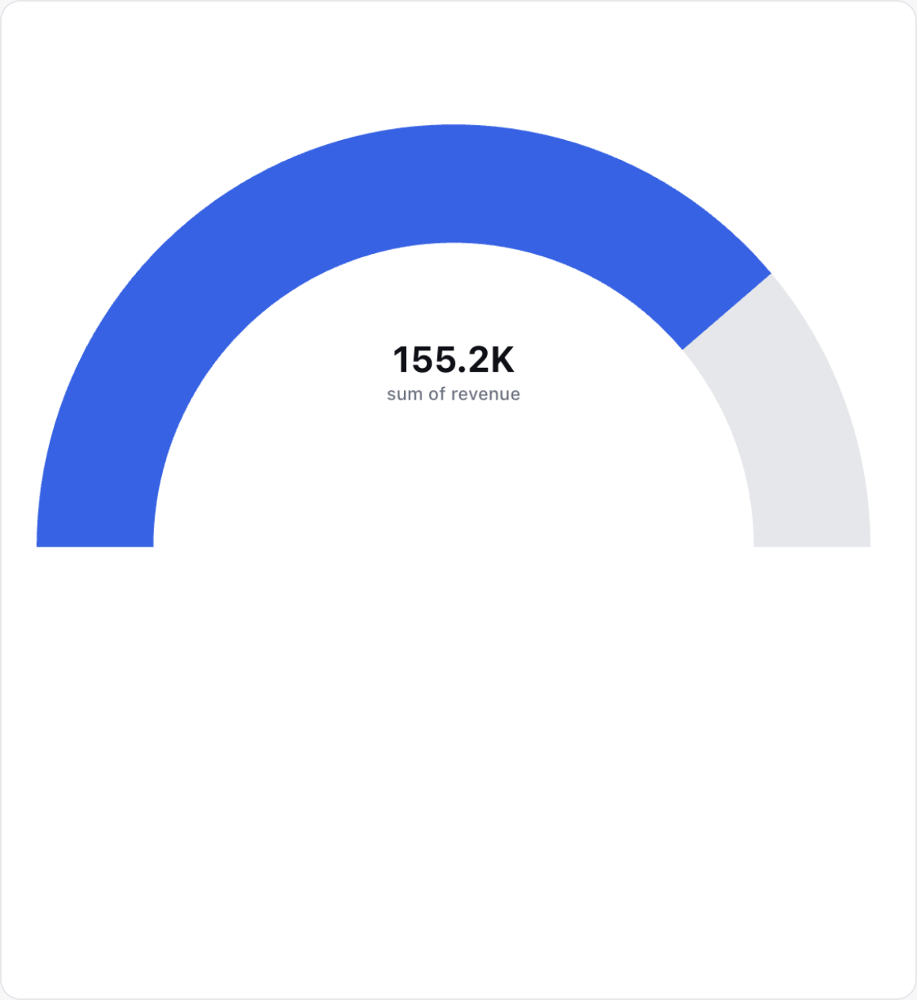
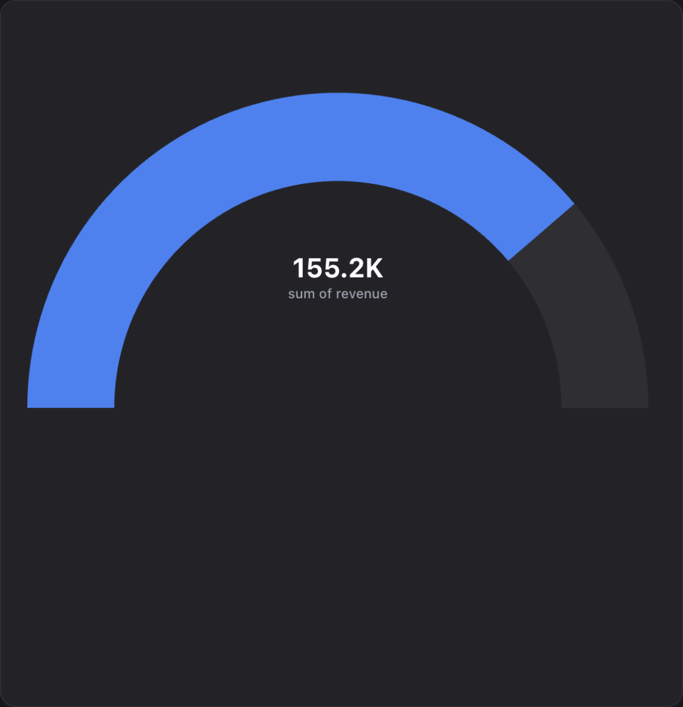
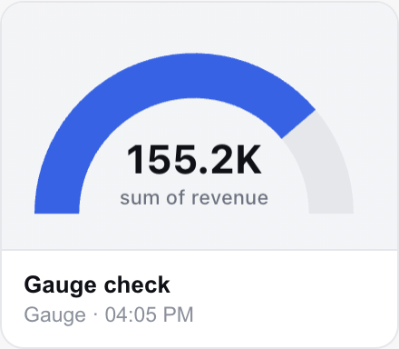
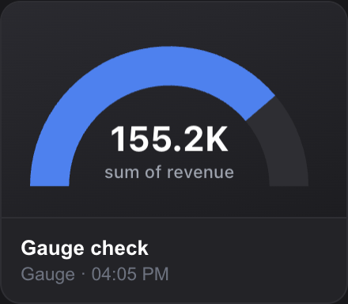

# A gauge is not a pie: keep it out of `roundLabels`

`isRound` in `chartTypeSpec.ts` is `chartType === 'pie' || chartType === 'doughnut'`,
and a gauge IS drawn as a Chart.js doughnut — correctly, for datasets, cutout and
rotation. Not for `roundLabels`, the plugin that writes a category name onto each
big-enough slice: a gauge's two "slices" are a value and its remainder, not
categories, and its label is the metric name the `gaugeCenter` plugin already
prints under the big number.

So the gauge wrote its own caption twice, and gave the leftover arc a figure that
means nothing on its own.

## Full size — the case that was broken

| Before | After |
|---|---|
|  |  |
|  |  |

Before: **sum of revenue** and **155.2K** on the arc, the same two strings again
in the middle, and **44.8K** — the remainder, a number no one asked for — floating
on the grey. After: the gauge says what it measures, once.

Both shots are the real app on the bundled sample (`Retail orders`, `sum of
revenue` by `category`), driven through the Visuals builder, light and dark, with
**zero renderer console errors**.

## The tile was already quiet — and that was the problem

| Before | After |
|---|---|
|  |  |
|  |  |

Identical (bar the clock in the card's meta line). At a ~150px tile PR #140's fit
gate rejects the text because it no longer fits the thin ring — so the duplicate
was already invisible there, by accident, hidden behind a rule that has nothing to
do with it. That is why fixing the tile would have been fixing the wrong thing:
the gauge should never have been running the plugin at any size.

## Scope

One condition, at the place the plugin is added:

```js
if (isRound && !isGauge) {   // chartValueLabels.ts
```

`isRound` itself is left alone — a gauge is a doughnut for every other purpose,
and narrowing it would reach datasets, scales, cutout and rotation for no gain.

`scripts/test-chartSpec.ts` moved **exactly 3 of 84** golden hashes —
`gauge/default`, `gauge/custom`, `gauge/filtered` — and pie and donut did not,
which is the shape a change confined to one per-family plugin must have. The same
file also now asserts the fact directly, because a hash cannot say WHICH plugin a
config carries: a gauge has `gaugeCenter` and no `roundLabels`; pie and donut have
`roundLabels` and no `gaugeCenter`.
