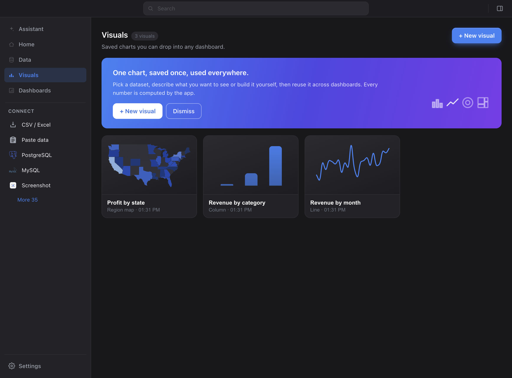

# Map thumbnails in the Visuals gallery

Gallery cards render a live miniature of the visual they open. Map cards did not:
`VIZ_THUMB_SKIP` in `renderer/hub/vizThumbs.ts` excluded `map_choropleth` and
`map_bubble` because MapLibre needs WebGL2 and the visible hub window, so it
cannot draw into a card. Next to two real miniatures, the generic map glyph read
as a failed card.

**The constraint is still correct and unchanged** — nothing here renders MapLibre
in a thumbnail. Instead `renderer/hub/mapThumb.ts` draws a *static mini
choropleth* onto a plain 2D canvas from parts the app already ships:

- boundaries from `assets/geo` (`postinstall`), pulled through a new `geo` lazy
  bundle — the same two files the `map` bundle carries, **without** MapLibre's
  714K, since a picture of polygons has no use for a WebGL renderer;
- the row → region join from `renderer/hub/geoMatch.ts`, unchanged;
- the fill scale from `mapRender.getChoroplethColor`, so a thumbnail and the map
  it opens are the same colours in both themes;
- an equirectangular fit with the standard parallel at the bbox mid-latitude,
  framed on the **matched** regions exactly as the live map's `_fitBBox` is.

No WebGL, no tiles, no network, no labels, no legend, no interaction. A shape,
not a map — which also means it works in the offscreen report window.

`map_bubble` stays honest: its polygons keep the empty fill and the values are
drawn as circles at each region's centroid (the same derivation the live bubble
map uses). It is never dressed up as a choropleth.

Levels with no bundled polygons (`us_city`, `us_zip`, `point`) and any load or
draw failure fall back to the card glyph, silently — vizThumbs' existing rule
that a broken card is worse than a plain one.

## Screenshots

The bundled sample's "Profit by state" choropleth in the Visuals gallery, driven
through the real app with Playwright. Zero renderer console errors in both.

| Light | Dark |
| --- | --- |
|  |  |
