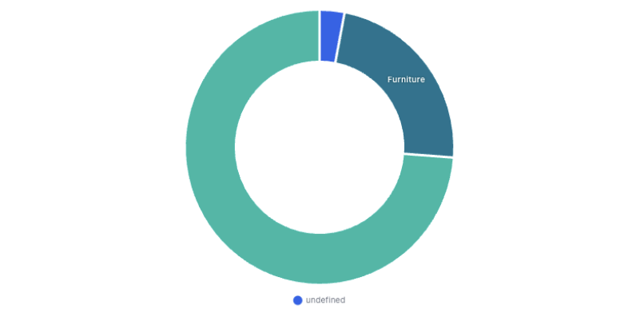
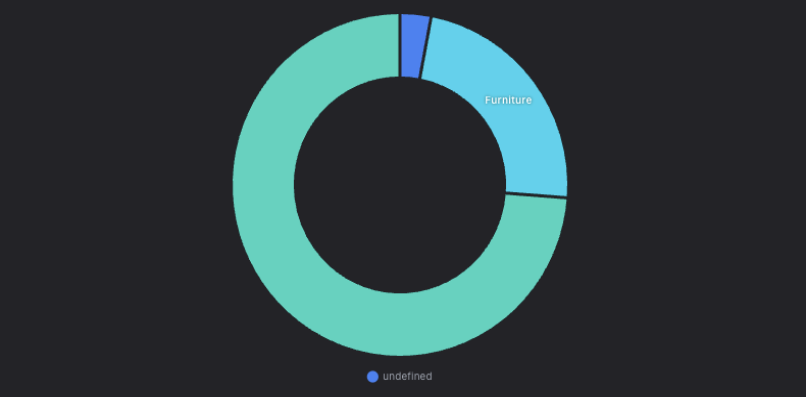
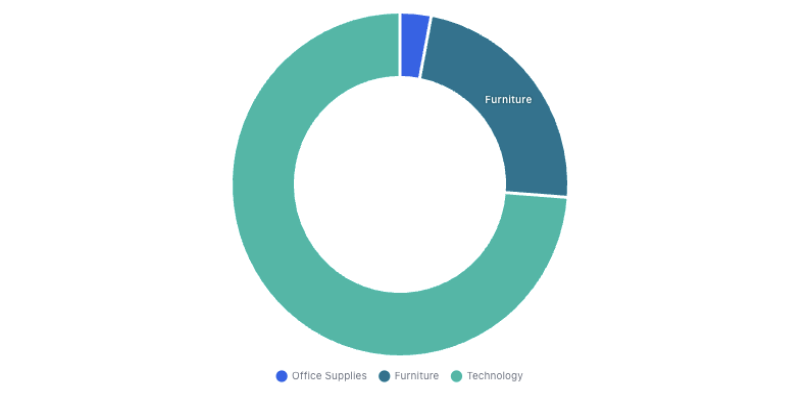
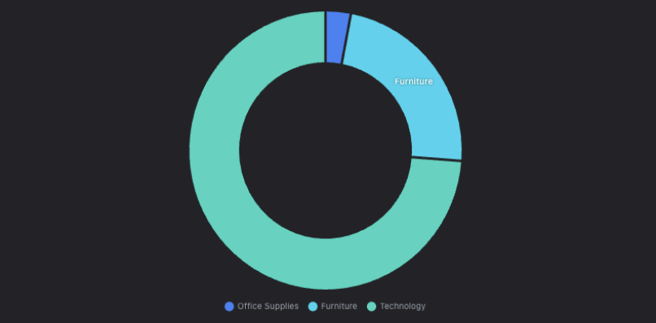
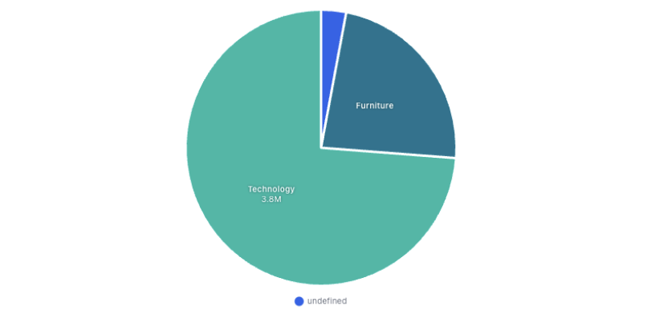
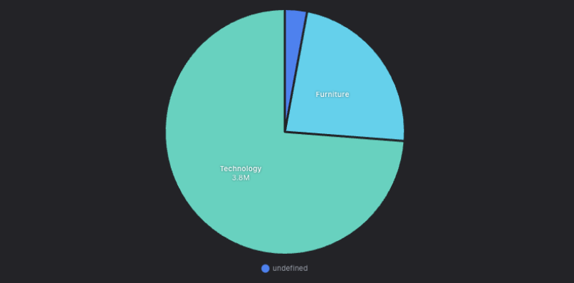
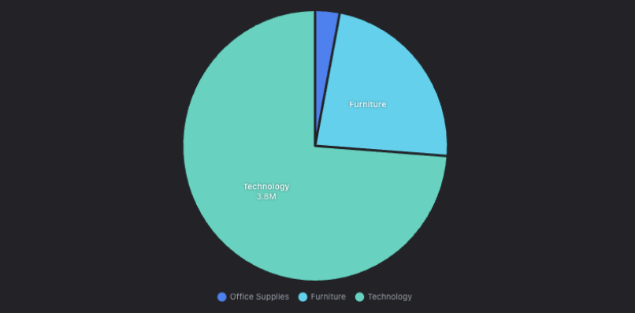

# The round-chart legend: one blank entry instead of one per category

A pie or donut rendered a legend of **one empty item**, whatever the data. Read
out of the running app against the bundled sample's `revenue by category`:

| type | `legend.display` | `generateLabels(chart)` texts |
|---|---|---|
| donut | `true` | `[null]` |
| pie | `true` | `[null]` |
| bar | `true` | `["sum of revenue"]` |
| line | `true` | `["sum of revenue"]` |
| column | `true` | `["sum of revenue"]` |

Exactly the round family, and the raw captures are in
[`before-legend.json`](before-legend.json) / [`after-legend.json`](after-legend.json).

| | Light | Dark |
|---|---|---|
| **Before** — donut |  |  |
| **After** — donut |  |  |
| **Before** — pie |  |  |
| **After** — pie |  |  |

## Why it was urgent, not cosmetic

Look at the thin blue wedge at the top of the donut. It carries no in-slice
label, because [#140](../donut-labels/README.md) now drops a label the slice
cannot hold — on the plugin's standing promise that *small slices fall back to
the legend*. `legendOnByDefault()` in `renderer/hub/chartTraits.ts` returns true
for pie and donut precisely so that fallback exists.

It did not exist. Before, that slice's only name was a legend reading
**"undefined"** — the same legend visible under both charts in #140's own
[`after-fullsize.png`](../donut-labels/after-fullsize.png). A slice could lose
its name entirely. After, the legend names all three categories, so *Office
Supplies* is identifiable even though its wedge is too thin to write in.

## Cause

`buildChart` overrides `legend.labels.generateLabels` for one good reason: a
line/area swatch defaults to a hollow box (transparent fill), and the override
repaints it solid. It sourced the base list from

```js
window.Chart.defaults.plugins.legend.labels.generateLabels(chart)
```

which is the **dataset-based** generator — one item per dataset, its text taken
from `dataset.label`. Pie and doughnut do not use that one. Chart.js puts a
**per-slice** generator on `Chart.overrides.doughnut`, and `PieController` has no
`overrides` of its own so it inherits doughnut's as a static class property:

```
Chart.overrides.doughnut.plugins.legend.labels.generateLabels  → function
Chart.overrides.pie.plugins.legend.labels.generateLabels       → function
Chart.overrides.bar.plugins.legend.labels.generateLabels       → undefined
```

A round chart draws its three categories from ONE dataset, so the dataset-based
generator returned a single item, and that dataset has no `label` — hence
`[null]`, rendered as "undefined".

The fix starts from the generator the chart **type** would have used, falling
back to the global default (right for bar/line/everything else), then applies the
same line/area recolouring on top.

## Tests

`scripts/test-chartSpec.ts` freezes the config as a hash, with callbacks kept as
source text. It could not have caught this: the callback was stable, and *wrong*.
So `scripts/test-chartLegend.ts` **invokes** the legend callback the config
carries and asserts the resulting **texts** — categories for pie/donut, series
names for bar/column/line/area, plus the solid line swatch the override exists
for. Texts, not counts: one `null` and one string are both "length 1", which is
how the bug hid. It runs the real `chart.umd.js` in the sandbox, so
`Chart.overrides` is Chart.js's own rather than a stub asserting itself.

All 84 chartSpec hashes moved, and that is the honest shape here — unlike
`roundLabels`, this callback lives in the one options block every chart id
shares. Verified confined before regenerating: with `ORDINATE_CHARTSPEC_DUMP` set
on both sides, the only differing line across all 84 dumps is that callback's
first statement.

Shots taken at 1440×900 on a fresh `--user-data-dir`, both themes, **zero
renderer console errors**.
