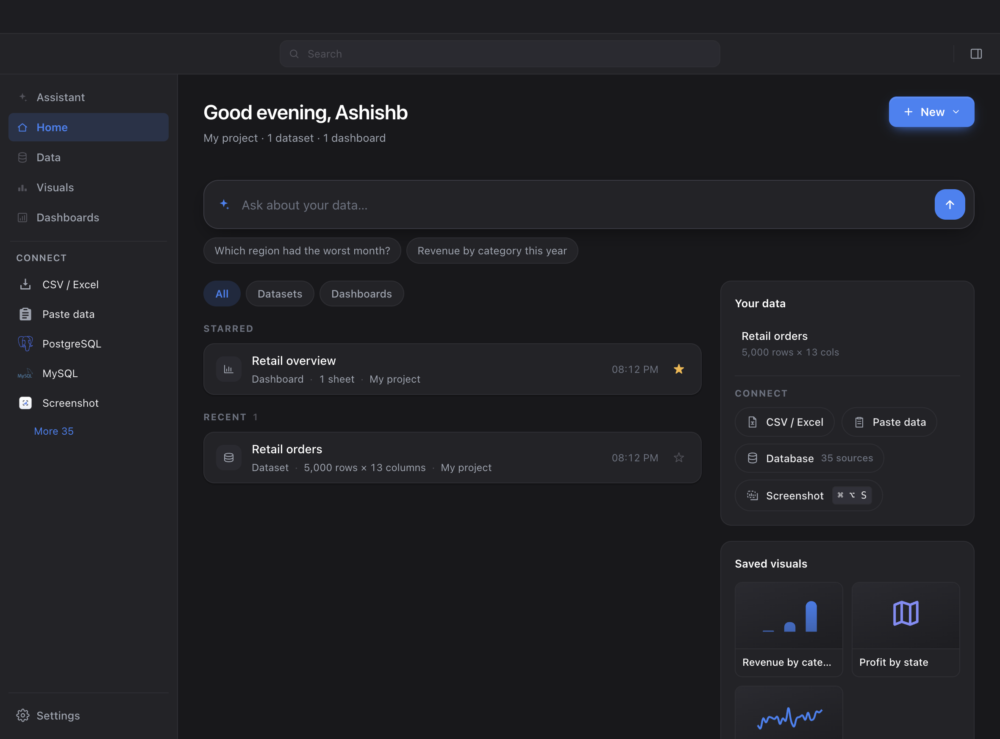
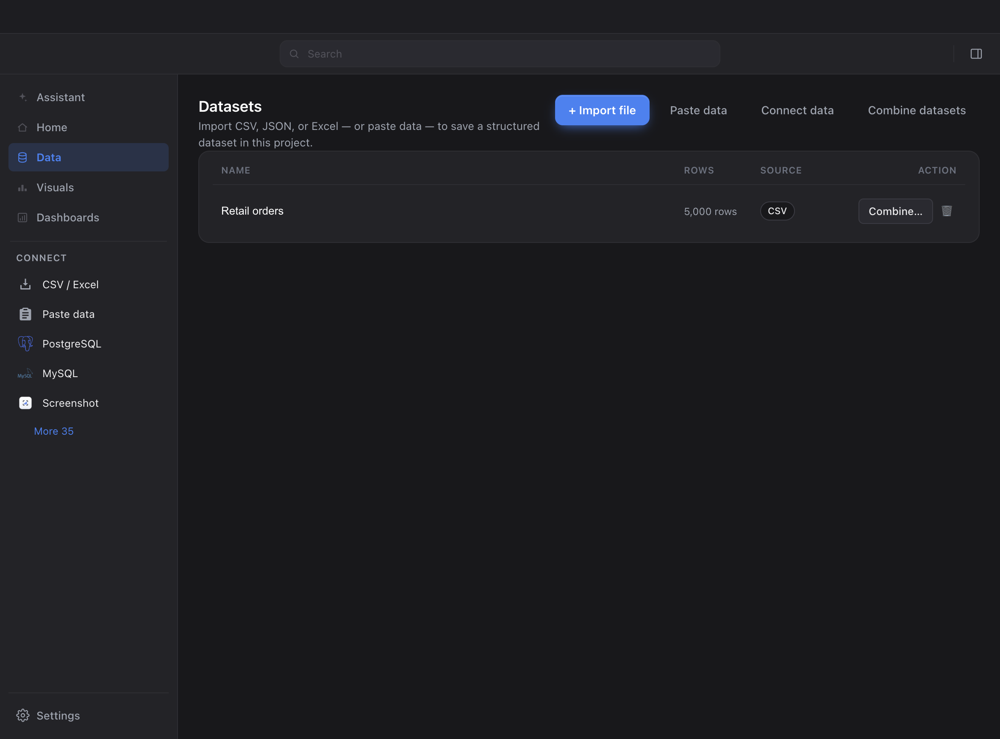
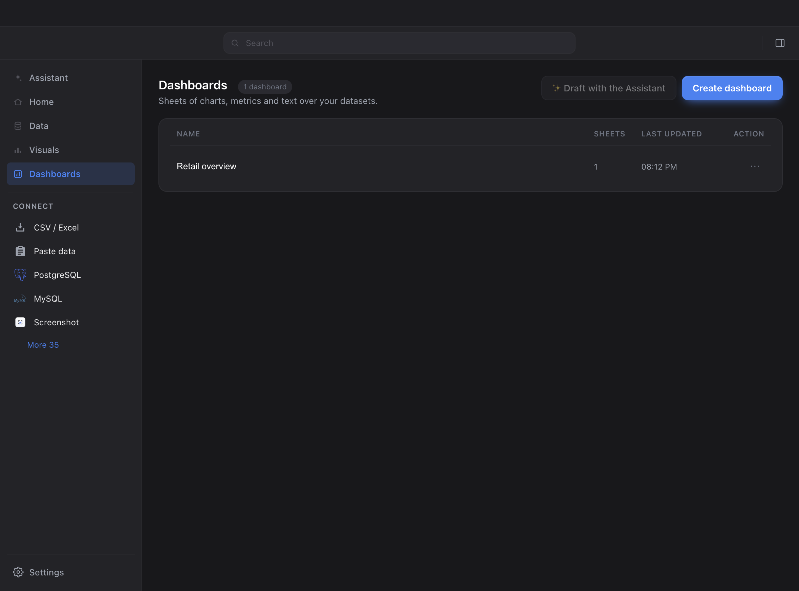
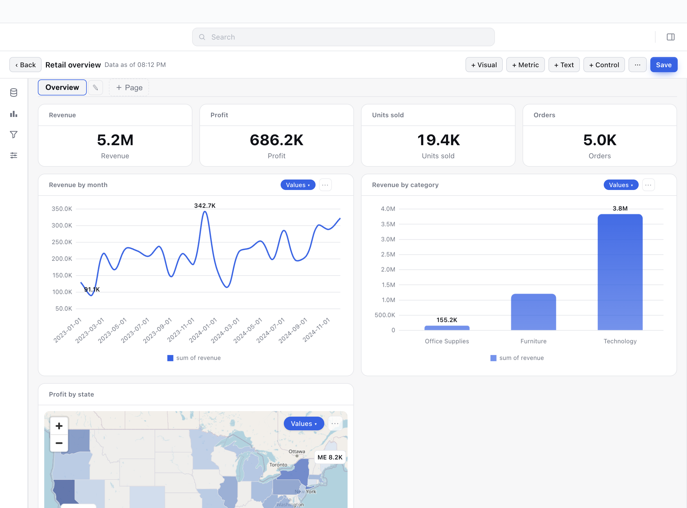
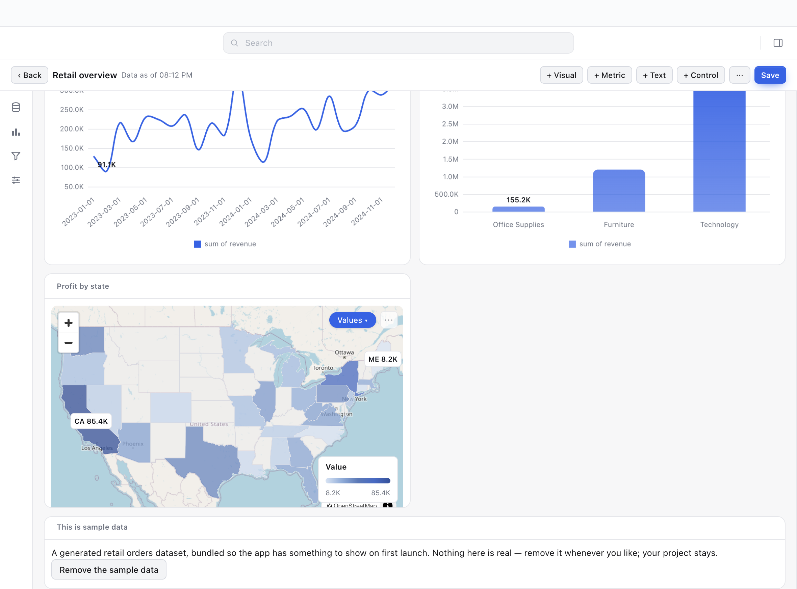

# The sample, seeded into the user's own first project

Real-app captures on a fresh `--user-data-dir` (Playwright `_electron.launch`,
the same pattern `scripts/smoke-sample.ts` uses), taken at PR time. Same place
and pattern as `docs/ask-redesign/` and `docs/dock-redesign/`.

## Home — the counts now agree with Starred

`My project · 1 dataset · 1 dashboard`, over a Starred row for "Retail overview"
and a Recent row for "Retail orders", both labelled `My project`. Before this
change the same screen read `My project · 0 datasets · 0 dashboards` above those
same two rows: Recent and Starred are global across projects, the header is
scoped to the adopted one, and the sample was in a project the user had no way
to see.

## Data and Dashboards — no longer empty states

| Data | Dashboards |
|---|---|
|  |  |

## The sample dashboard, opened from Home

## The note card

The button is now **Remove the sample data** and takes the dashboard, its three
charts and the dataset — not the project, which is the user's only one. The
heading used to be drawn twice (once in the card head, once in the body), which
pushed the body past its two-row height and clipped the note's first line; the
duplicate is gone, and every other text card gains the same fix.
