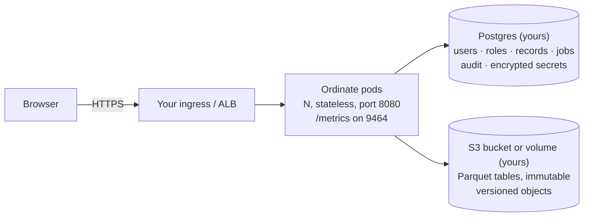

# Running the Ordinate server

These pages are for the team that deploys and operates Ordinate. Ordinate is a self-hosted web app:
one stateless container image, plus a Postgres database and an S3 bucket (or a volume) that you
provide. People open a URL and sign in with your identity provider (or with Ordinate's own
password accounts while you try it out).

## Start here

| If you want to… | Read |
|---|---|
| Try it on one machine in five minutes | [quick-start.md](quick-start.md): Docker Compose with Postgres and MinIO |
| Run it on Kubernetes in AWS | [eks.md](eks.md): Helm, IRSA, RDS, S3, ALB |
| Run it on ECS | [ecs.md](ecs.md): Fargate task definition, Secrets Manager |
| Run it on GKE or AKS | [gke-aks.md](gke-aks.md): what differs, and what is untested |
| Connect your IdP | [sso.md](sso.md): Okta, Entra ID, Google, Keycloak, Auth0, oauth2-proxy |
| Turn on AI | [ai.md](ai.md): Admin → AI, connect a provider, choose the models members may use |
| Look up a setting | [configuration.md](configuration.md): every environment variable the server reads |
| Connect a warehouse or use Live data | [live-data.md](live-data.md): Live datasets and cache age, Snowflake's and BigQuery's read-only roles, what a query can cost, the refresh URL |
| Plan capacity | [sizing.md](sizing.md): measured numbers and starting points |
| Protect the data | [backup-restore.md](backup-restore.md): Postgres, the bucket, the master key |
| Move between versions | [upgrade.md](upgrade.md): releases, migrations, rollbacks |

## What you get from a release

> **No release has been published yet.** Until the first one, build the image from a checkout
> (`docker compose up -d --build`, or `docker build -f deploy/Dockerfile .`) and install the chart
> from `deploy/helm/ordinate`.

Each GitHub Release (tag `v<version>`, built by `.github/workflows/release.yml`) ships:

- **`ghcr.io/ashishb2000/ordinate:<version>`**: one image for linux/amd64 and linux/arm64, under
  600 MB, running as a non-root user (uid 1000). It carries OCI labels for its source, revision and
  version. The image never downloads anything at run time: DuckDB's S3 extensions and the map
  boundaries are baked in.
- **`ordinate-<version>.tgz`**: the Helm chart, with its version and default image tag set to the
  release.

## Who is responsible for what

**Ordinate** (the software) handles:

- sign-in, sessions, roles and tenant isolation inside the app;
- the SSRF guard on every connector;
- DuckDB locked to each org's own data;
- secrets encrypted at rest and never sent to a browser or written to a log;
- CSRF protection, CSP and security headers.

The threat model (`docs/phase-7-web/threat-model.md`) names the test behind each of these.

**You** (the operator) handle:

- the network, ingress and TLS;
- the pod's cloud identity (IRSA, task role);
- Postgres and the bucket, including their encryption and backups;
- your IdP and who it lets in;
- patching the cluster;
- applying our releases.

Report a vulnerability as described in [`SECURITY.md`](../../SECURITY.md).

## Three things that bite on day one

1. **`ORDINATE_MASTER_KEY` is irreplaceable.** Back it up outside the cluster. Without it, every
   stored connection password and AI key is unreadable, even from a good database backup.
2. **More than one pod needs sticky sessions** at the load balancer. Uploads, downloads and AI plan
   runs are held by the pod that started them.
3. **A private-CA Postgres (Amazon RDS, Cloud SQL) needs its CA**, or `sslmode=no-verify`. With
   `sslmode=require` and nothing else, the pod exits at boot. See
   [configuration.md](configuration.md#tls-to-postgres).
