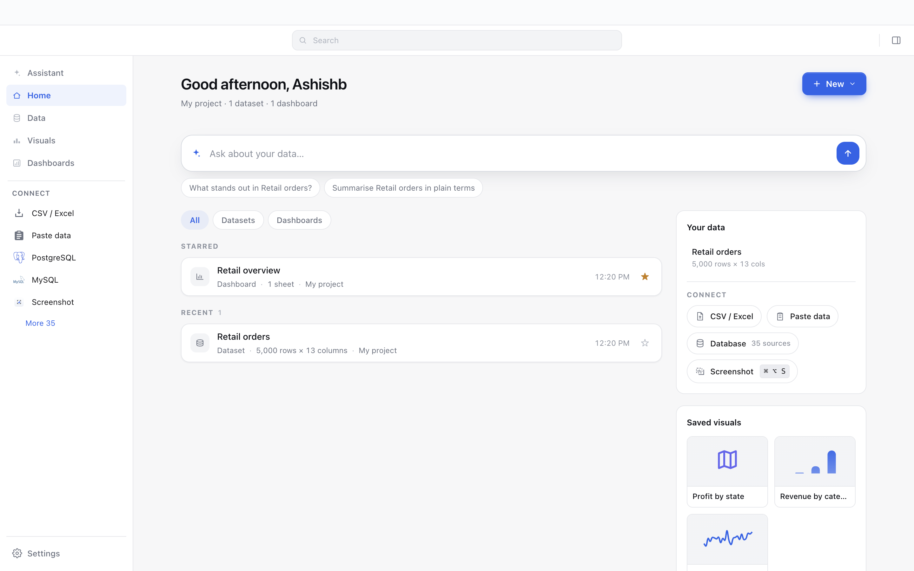
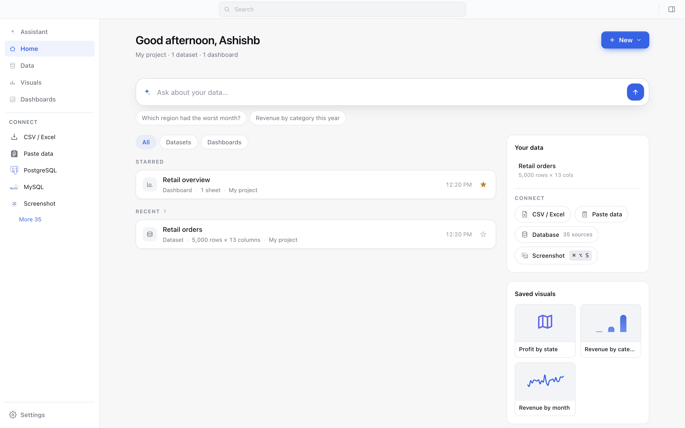
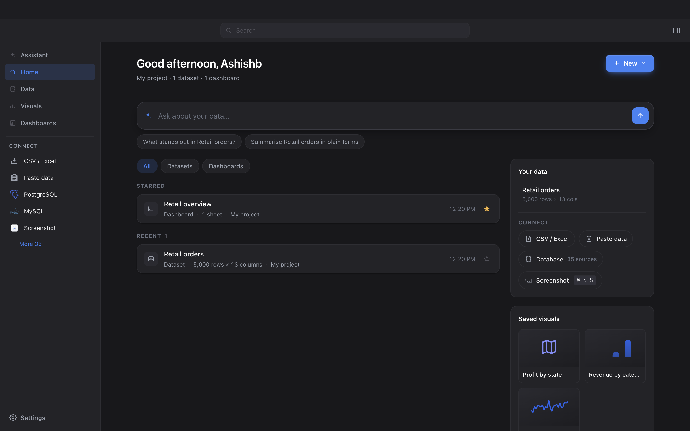
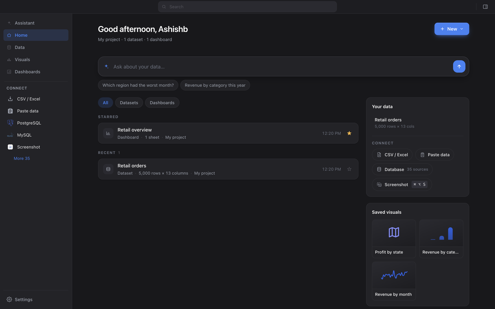

# One top bar

Real-app captures on a fresh `--user-data-dir` (1440×900), before and after.
Same place and pattern as `docs/ask-redesign/` and `docs/dock-redesign/`.

| | Before | After |
|---|---|---|
| **Light** |  |  |
| **Dark** |  |  |

The before shots have an empty band across the top above the search — that is
`.titlebar`, a 40px strip whose only content was nothing. It existed to hold
vertical space for the macOS traffic lights and the Windows control overlay.

Measured off the rendered page:

| | before | after |
|---|---|---|
| `.titlebar` elements | 1 | 0 |
| `.hub-topbar` top / height | 40 / 48 | 0 / 40 |
| `.hub-body` starts at | 88px | 40px |
| top bar `-webkit-app-region` | `none` | `drag` |
| `.hub-search-wrap` region | `none` | `no-drag` |
| search centre vs window centre | 720 / 720 | 720 / 720 |

48px of chrome returned to the content, and the search is still centred on the
window — the OS reservations are `min-width` on the equal-flex side spacers, not
padding on the row, so the centring survives them until the window is narrow
enough that clearing the traffic lights matters more.

## Why 40px and not 48

The merged row kept the old strip's 40px rather than the old top bar's 48. The
macOS traffic lights sat correctly in a 40px strip under `hiddenInset`, so
keeping that height keeps their placement known-good and needs no
`trafficLightPosition` offset — and such an offset could not have been verified
here anyway: a Playwright screenshot captures web contents, not the OS window
frame. The 32px search and the 32px toggle sit inside 40px with 4px either side.
